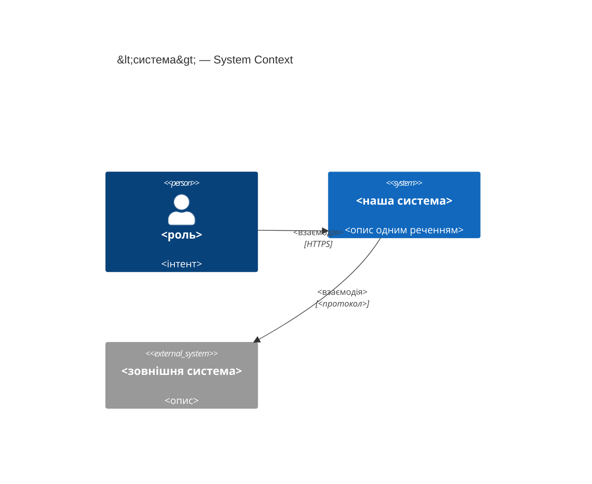
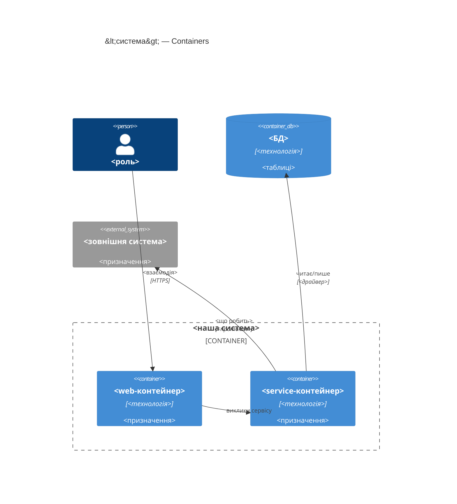
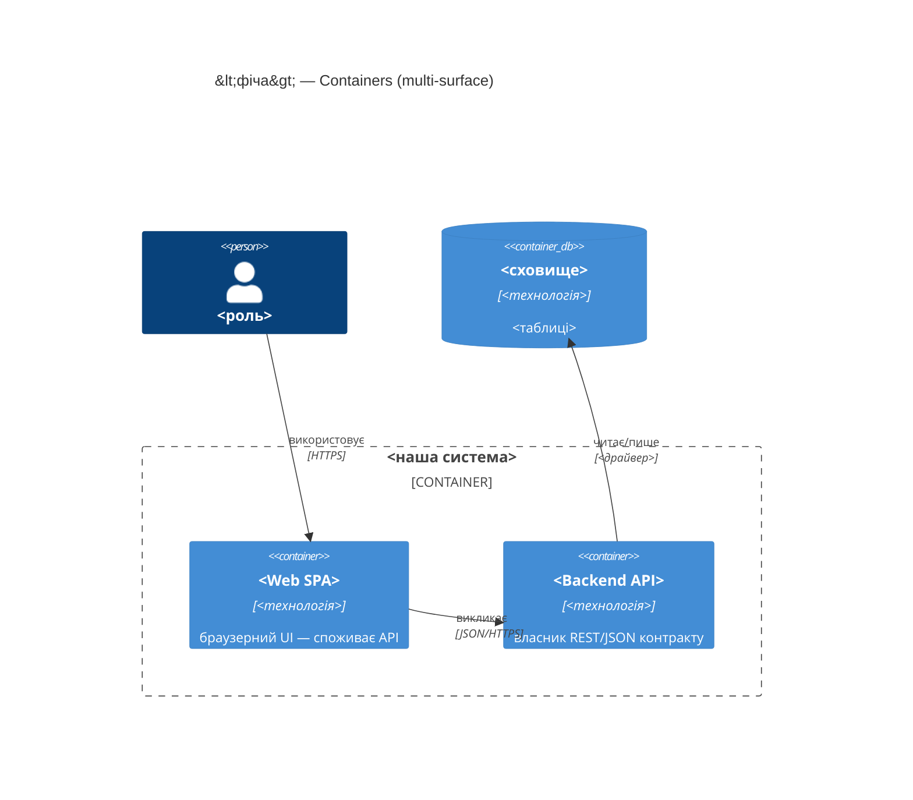

# C4 Mermaid — шпаргалka для sad.md §3 і §5

C4 — 4 рівні архітектурних діаграм, як zoom на мапі:

- **L1 Context** — система як чорний ящик + користувачі + зовнішні системи. **Це §3 SAD.**
- **L2 Container** — внутрішня декомпозиція: модулі, сервіси, БД, черги. **Це §5 SAD.**
- L3 Component, L4 Code — поза межами цього скіла (окрема діаграмна ітерація, якщо колись знадобиться).

**Як читати елементи:**
- `Person(...)` — внутрішній актор. `Person_Ext(...)` — зовнішній.
- `System(...)` — наша система. `System_Ext(...)` — зовнішня (напр. Vercel, платіжний провайдер).
- `Container(...)` — компонент всередині нашої системи (фронт, бек, воркер).
- `ContainerDb(...)` — наша БД/сховище. `Container_Boundary(...)` — рамка навколо групи (деплоїться разом).
- `Rel(від, до, "що робить", "як")` — стрілка з лейблом і протоколом.

**Кордон довіри** (trust boundary) — лінія, за якою дані більше не довіряємо без перевірки. На L1 — межа між нашими акторами і зовнішніми системами; на L2 — межа `Container_Boundary`.

## L1 — System Context (`C4Context`)

Використовується в §3. Система як один чорний ящик + люди + зовнішні системи. 5-10 елементів максимум.



**Типи елементів:**
- `Person(id, "name", "description")` — внутрішній актор.
- `Person_Ext(id, "name", "description")` — зовнішній актор.
- `System(id, "name", "description")` — внутрішня система.
- `System_Ext(id, "name", "description")` — зовнішня система.
- `SystemDb(id, "name", "description")` — зовнішня БД (рідко на L1).
- `Rel(from, to, "label", "protocol")` — звʼязок. Протокол опційний, але рекомендований.

**Правила:**
- Наша система — одна коробка. Декомпозиція — на L2.
- Зовнішня система = інший власник / інший процес / інший життєвий цикл. Внутрішні модулі одного застосунку на L1 **не** зʼявляються.
- 5-10 елементів всього. Більше — показуєш зайве.

## L2 — Container (`C4Container`)

Використовується в §5. Середина системи: застосунки, сервіси, БД, черги. Для монолітного репо — кожен модуль як логічний контейнер.



**Типи елементів:**
- `Container_Boundary(id, "label") { ... }` — групує контейнери одного деплой-юніту.
- `Container(id, "name", "technology", "description")` — внутрішній контейнер (застосунок, сервіс, воркер).
- `ContainerDb(id, "name", "technology", "description")` — внутрішнє сховище.
- `ContainerQueue(id, "name", "technology", "description")` — внутрішня черга.
- Зовнішні `System_Ext` і `Person` можна переносити з L1 без змін.

**Мультиповерхневі фічі — один `Container` на кожну оголошену `target_surface`** (§4 SAD). `[backend-service, web-frontend]` малює і backend-API, і web/SPA — обидва UI-контейнери *споживають* контракт API, жоден його не авторить:



## Типові помилки

- **Змішування рівнів.** Component (окремий клас/функція) не належить у Container-діаграму — або zoom out, або окрема L3-ітерація.
- **Одруки в `Container_Boundary`.** Часте: `Container_Bondary`, `ContainerBoundary` (без підкреслення). Mermaid мовчки рендерить порожній блок.
- **`Rel` до ще не оголошеного елемента.** Спершу всі `Person`/`Container`/`System*`, потім `Rel`.
- **L1 із внутрішніми модулями.** L1 — бізнес-межа. Якщо внутрішній модуль зʼявився на L1 — це вже L2.
- **`Rel` без лейбла чи протоколу.** «Звʼязано» нічого не каже читачу — завжди: що робить + як (HTTPS/gRPC/SQL/подія).

## Валідація перед комітом

`mmdc`/`node_modules/mermaid` у цьому контейнері немає — працює **структурний
лінт**, не справжній парсер (як у `map-architecture`):

- парні огорожі ` ```mermaid ` / ` ``` `;
- перший токен розпізнаний (`C4Context`, `C4Container`, `sequenceDiagram`, …);
- кожен елемент оголошено **до** першого `Rel`/`->>`, що на нього посилається;
- без `Container_Bondary`, без залишків `<placeholder>`;
- ідентифікатори без пробілів, у `Rel` лапкований підпис обовʼязковий;
- збалансовані дужки/лапки.

Не парситься після 3 спроб — не комітити, показати блок і помилку Mike.

## Коли діаграма не влазить

Якщо L2 Container не влазить у 10-15 елементів — розбити фічу на дві SAD (по
одному bounded context кожна), або винести тактичні контейнери (напр. воркер)
у примітку під діаграмою замість захаращення. Якщо L1 Context має 15+
зовнішніх систем — це вже документація організації, а не фічі; звузити до
«системи, з якими фіча говорить напряму».
