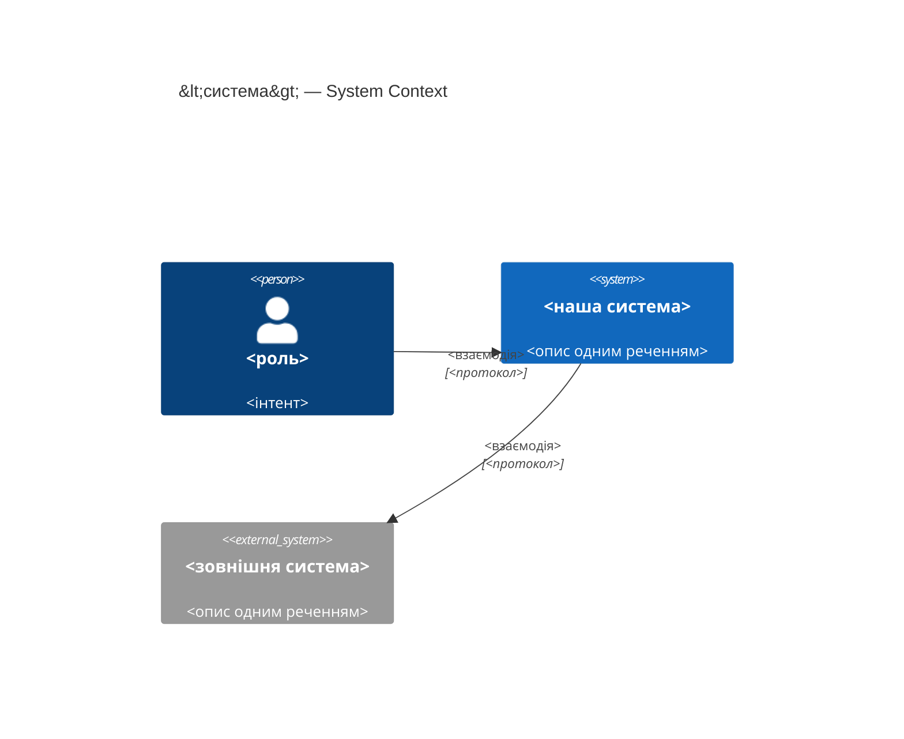
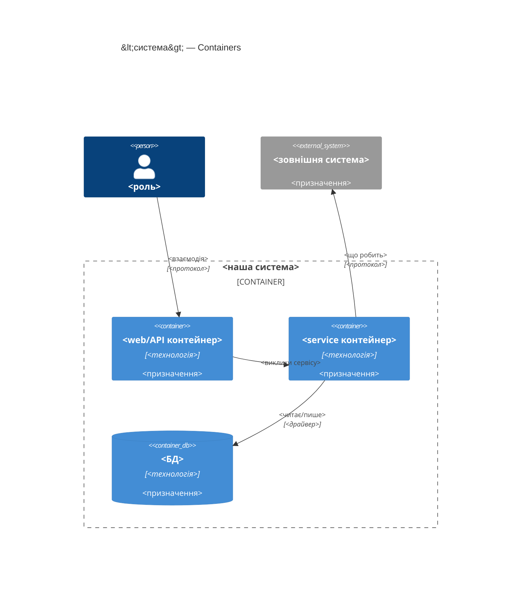
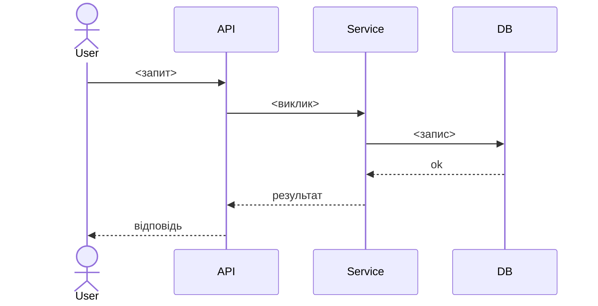

# Software Architecture Document — <slug>

<!-- 12 секцій arc42. Порожня секція — лише <!-- N/A: причина одним реченням -->.
C4 Context (L1) inline у §3. C4 Container (L2) inline у §5.
§6 сіє лише головний потік — решту AC покриє майбутня стадія complete-sequence-diagrams.
Числа в §10 — ДОСЛІВНО з PRD §6 NFR, без округлень і вигадок. -->

## 1. Вступ і цілі

<!-- 1 абзац наміру з PRD §2 Цілі + топ-3 якості (повні сценарії — у §10) + таблиця stakeholders. -->

**Намір.** <один абзац із PRD §Цілі — що будуємо і для кого>

**Топ-3 якості (одним рядком; повні сценарії в §10):**

1. <напр. «Доступність при частковому збої залежного модуля»>
2. <напр. «Швидкодія під зростання масштабу»>
3. <напр. «Відновлюваність контрольних точок за <30 хв»>

**Stakeholders.**

| Роль | Інтерес | Sign-off? |
|---|---|---|
| <роль лише з CONTEXT.md> | <що саме зачіпає> | Ні |
| <роль лише з CONTEXT.md> | <що саме зачіпає> | Ні |
| Tech Lead | Затвердження SAD | Так |

<!-- Decision overrides (¶4) — заповнює резолюція критика на кроці 7, інакше порожньо. -->
<!-- Формат рядка: «Decision override: <заголовок> — rationale: <причина>» -->

## 2. Обмеження

<!-- §4 (стратегія) працює лише коли §2 зафіксувала, ЩО ВЖЕ ЗАФІКСОВАНО — це вхід, не вихід. Ніколи N/A. -->

**Технічні.**
- <мова + версія>
- <фреймворк + версія>
- <сховище даних + версія>
- <архітектурна конвенція репо, напр. з `docs/architecture-map.md`>

**Організаційні.**
- <бюджет часу, якщо PRD §2 його називає>
- <дедлайн, якщо є — інакше `<TBD by PM>` + рядок у §11>
- <склад команди>

**Конвенції.**
- <посилання на CLAUDE.md / конвенції репо>
- <нейминг, ID-стратегія, патерн обробки помилок>

**Регуляторні / зовнішні.**
- <з PRD §6.1 Security/privacy — застосовні контролі>
- <ніколи N/A — якщо PRD §6.1 порожній, написати чому>

## 3. Контекст і межі

<!-- Малює МЕЖУ СИСТЕМИ — хто говорить з нею ззовні, де закінчується зона довіри. Ніколи N/A. -->

<2-3 речення бізнес-контексту з PRD §1>

**Зовнішні системи (in/out):**

| Актор або система | Тип | Взаємодія |
|---|---|---|
| <роль з CONTEXT.md> | Person | <що робить> |
| <внутрішня система> | System (internal) | <взаємодія> |
| <зовнішня система> | System (external) | <взаємодія> |

**C4 Context (L1):**



<!-- greenfield без коду й мапи → <!-- brownfield: N/A — greenfield repo --> замість цитувань конвенцій. -->

## 4. Стратегія рішення

<!-- 3-4 СТРАТЕГІЧНІ СТОВПИ, з яких ростуть ADR. Найгустіша секція — gate спрацьовує майже завжди. -->

**Target surface(s) (перше рішення — що саме будуємо):** `<напр. [backend-service, web-frontend]>`
<!-- Дзеркалити у frontmatter target_surfaces. На кожну оголошену UI-поверхню (web-frontend/
mobile-app/desktop-app) — окреме рішення UI-архітектури нижче (web → SSR/SPA/hybrid;
mobile → native/cross-platform). Більше однієї поверхні — зазвичай ADR. UI переюзає наявну
дизайн-систему з architecture-map.md §Фронтенд, не винаходить заново. -->

**Стратегічні вибори (насіння для ADR):**

1. **<напр. Ізоляція модулів через події>** — <2-3 речення rationale з посиланням на Топ-3 якості + Обмеження>.
2. **<напр. Єдине сховище>** — <2-3 речення>.
3. **<напр. UI-архітектура: SPA, що споживає backend API>** — <на кожну оголошену UI-поверхню; 2-3 речення>.

Кожне тактичне рішення в наступних секціях має простежуватись до одного з цих
стовпів. Тактичне рішення, що суперечить стовпу, — червоний прапорець, виносити
в §11.

## 5. Будівельні блоки

<!-- ВНУТРІШНЯ ДЕКОМПОЗИЦІЯ — модулі, контейнери, БД. Хто з ким може говорити. -->

<1 абзац: шарова / гексагональна / clean / event-driven архітектура. Чому.>

**Внутрішня декомпозиція:**

```
<напр. app/lib/<модуль>/>
├── domain/       <сутності + sentinel-помилки>
├── app/          <use cases / сервіси>
├── infra/        <реалізація репозиторіїв>
├── ports/        <handlers, DTO, мапінг помилок>
└── module.ts     <self-wiring>
```

**C4 Container (L2):** один `Container` на кожну оголошену `target_surface`
(fullstack `[backend-service, web-frontend]` — контейнер backend-API + контейнер
web/SPA; приклад нижче для однієї поверхні, додати/замінити під §4).



## 6. Виконання (runtime)

<!-- ПОТІК RUNTIME для 1-2 критичних сценаріїв. Учасники — імена з §5, нових не вигадувати.
Повідомлення семантичні, БЕЗ HTTP-методів/шляхів — це територія майбутнього api-forge.
Цей скіл сіє лише головний потік; повне покриття кожного AC — окрема майбутня стадія. -->

**Критичний потік 1: <назва>**



<!-- Для XS/S — 1 потік достатньо. Для M+ — додати 2-4 (failure-mode, async). -->

**Критичний потік 2: <напр. поширення події>** — <якщо застосовно, інакше N/A>.

## 7. Розгортання

<!-- ТОПОЛОГІЯ — скільки реплік, де живе фоновий обробник, при яких числах масштабуємось.
N/A допустимо для XS/S, що переюзає наявне розгортання без змін. -->

<Топологія у 2-3 реченнях: де живе, репліки, пороги масштабування.>

**Моніторинг:**
- <метрики>
- <алерти>
- <трасування>

**Пороги масштабування:**
- <конкретне число, не «при зростанні подумаємо»>

<!-- Для XS/S без змін розгортання: <!-- N/A: фіча переюзає наявний деплой-юніт --> -->

## 8. Наскрізні концепції

<!-- НАСКРІЗНІ ПАТЕРНИ через кілька модулів: логування, помилки, авторизація, ID-стратегія, кеш.
Патерн всередині одного модуля — не сюди. Конвенція проєкту в цілому — у CLAUDE.md, не тут. -->

| Концепція | Конвенція | Де визначено |
|---|---|---|
| Логування | <напр. структуроване, поля `module=<name>`> | <CLAUDE.md §X або тут> |
| Автентифікація | <напр. сесія / JWT> | <CLAUDE.md §X> |
| Обробка помилок | <sentinel → ports → JSON-мапінг> | <CLAUDE.md §X> |
| ID-стратегія | <UUID v7 / auto-increment> | <CLAUDE.md §X> |
| Інтернаціоналізація | <напр. N/A, лише UA> | — |
| Спостережність | <метрики/трасування, якщо є> | — |

## 9. Архітектурні рішення

<!-- ЗВОРОТНИЙ ІНДЕКС на adr/. Один рядок на ADR. Заповнюється по ходу кроку 6 gate, не тут заздалегідь. -->

| # | Назва | Статус | Секція |
|---|---|---|---|
| <NNNN> | <у формі рішення, напр. «Use sliding window for rate limiting»> | Accepted | §<N> |

ADR-файли — `docs/features/<slug>/adr/NNNN-<title>.md`.

<!-- N/A допустимо лише якщо жодне рішення не спрацювало на gate (типово для XS): <!-- N/A: no decisions crossed blast-radius threshold --> -->

## 10. Вимоги якості

<!-- ДЕРЕВО ЯКОСТЕЙ — кожна ціль з §1 розкладена на When/Then/How-verify. Числа ДОСЛІВНО з PRD §6 NFR. -->

**QG-1. <якість>**
- **When:** <умова тригера>
- **Then:** <очікувана поведінка з числом з PRD NFR>
- **How verify:** <тест / навантажувальний прогін / метрика — не «інтеграційний тест»>

**QG-2. <якість>**
- **When:** <умова>
- **Then:** <очікувано>
- **How verify:** <як>

**QG-3. <якість>**
- **When:** <умова>
- **Then:** <очікувано>
- **How verify:** <як>

## 11. Ризики та технічний борг

<!-- Збирає ВСЕ, що може зламатись — не лише технічне. Ніколи N/A. -->
<!-- Severity: Low/Medium/High для звичайних ризиків; літерально "Open question" для рядків
     з дії «Винести у відкрите питання» на кроці 6. -->

| Ризик / борг | Серйозність | Мітигація | Власник |
|---|---|---|---|
| <напр. затримка outbox під час збою даунстріму> | Medium | <алерт, план дій, retry> | <роль> |
| Open architectural decision: <заголовок> | Open question | Resolve before <дата/стадія>; <причина> | <власник> |

**Прийнятий борг (ок для v1, план на потім):**
- <напр. сутність без версіонування — ок для v1>

## 12. Глосарій

<!-- СЛОВНИК ДОМЕНУ. Джерело — CONTEXT.md + терміни, що зʼявились під час Socratic walk. Ніколи N/A. -->

| Термін | Значення |
|---|---|
| <термін з CONTEXT.md> | <значення> |
