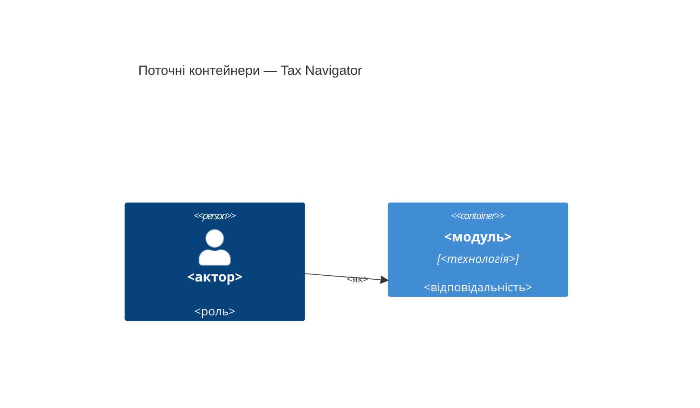

# Карта архітектури — Tax Navigator

> **Поточний** стан (що є сьогодні), згенеровано скілом `map-architecture`.
> Читають наступні стадії SDLC замість того, щоб перескановувати код.
> Оновити, коли репо відійшло від `reflects_commit`.
>
> `ARCHITECTURE.md` — авторський документ для людини, він **авторитетний** і тут
> не дублюється: ця карта звіряється з ним у секції «Звірка».

## Стек

<!-- мова, фреймворки, версії, команди білду й тестів. З цитатами файлів. -->

- Мова / рантайм: <…> (`file`)
- Фреймворки: <…>
- Білд / тести / лінт: <команди, які реально використовує репо>

## C4 — система як вона є

<!-- Context + Container того, ЩО ІСНУЄ (не цільовий дизайн). Реальні імена.
     Кожен вузол оголосити ДО першого Rel, що на нього посилається. -->

## Інвентар модулів

| Модуль | Шлях | Шар | Де зшивається | Відповідальність |
|---|---|---|---|---|
| <назва> | `<шлях>` | rules / calc / adapters / presentation | `<file:line>` | <один рядок> |

## Конвенції (цитовані — правила, яким має відповідати нова фіча)

- **Формат даних-правил:** <патерн> — `<file:line>`
- **Обробка помилок:** <патерн> — `<file:line>`
- **Ідентифікатори:** <патерн> — `<file:line>`
- **Доступ до даних / сховище:** <патерн> — `<file:line>`
- **Тести:** <стиль + харнес> — `<file:line>`
- **Міжшарова комунікація:** <патерн> — `<file:line>`
- **Локалізація / мова UI:** <патерн> — `<file:line>`

## Сховища даних

| Сховище | Рушій | Доступ через | Нотатки |
|---|---|---|---|

## Фронтенд / UI-фундамент

<!-- Це UI, який треба ПЕРЕВИКОРИСТОВУВАТИ, а не винаходити заново.
     У цьому репо фронтенд є — секція обов'язкова. -->

- **Дизайн-токени:** <кольори / відступи / типографіка — де джерело> — `<file>`
- **Підхід до стилів:** <CSS Modules / інше> — `<file>`
- **Спільні примітиви:** <наявні будівельні блоки> — `<шлях>`
- **Стан / збереження:** <де живе стан анкети> — `<file>`
- **Найближчий прецедент екрана:** новий екран схожий на `<наявний>` (`<file:line>`)

## Де що лежить / найближчі прецеденти

- Нова <категорія> фіча → `<шлях>`, за зразком `<наявна фіча>` (`<file:line>`).
- Новий екран → складається з наявних примітивів (§Фронтенд), за зразком
  `<наявний екран>` (`<file:line>`).

## Обмеження й відомий технічний борг

<!-- Те, що нова фіча мусить поважати або обходити. Живить write-prd. -->

- <обмеження / борг> — <як впливає на нову роботу>

## Звірка з `ARCHITECTURE.md`

<!-- Де карта збігається з авторським документом, і де знайдено дрейф.
     Дрейф — назвати, не «полагодити» мовчки. -->
