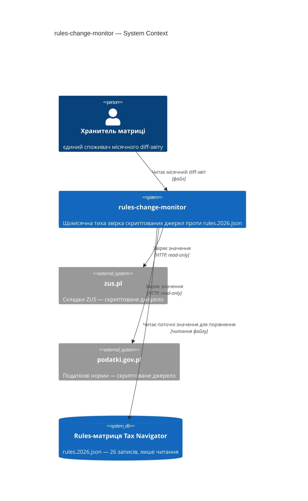
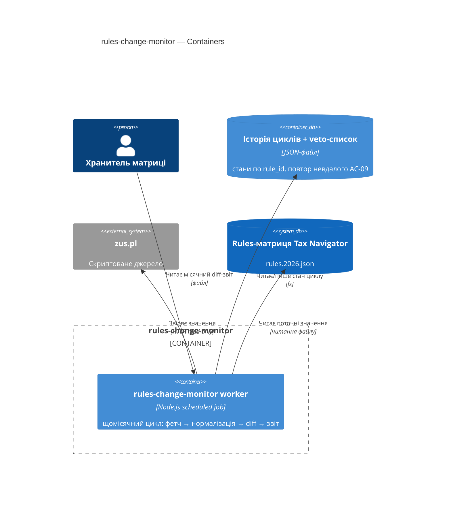
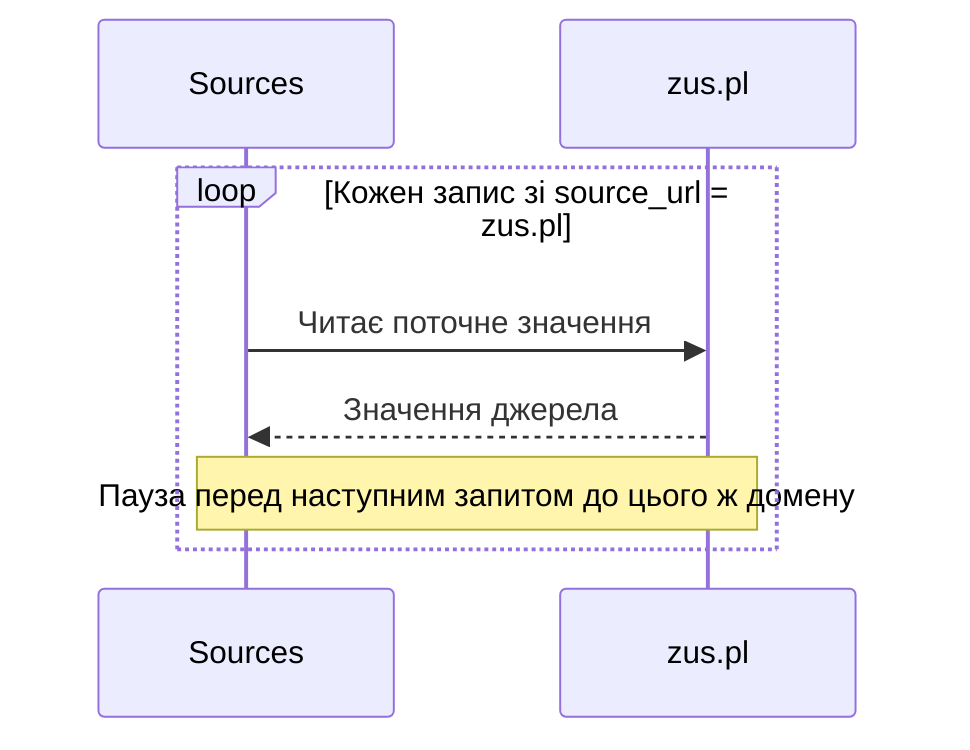

# C4 Mermaid — шпаргалка для sad.md §3 і §5 (worked-приклади цього репо)

C4 — 4 рівні архітектурних діаграм, як zoom на мапі:

- **L1 Context** — система як чорний ящик + користувачі + зовнішні системи. **Це §3 SAD.**
- **L2 Container** — внутрішня декомпозиція: модулі, сервіси, БД, черги. **Це §5 SAD.**
- L3 Component, L4 Code — поза межами цього скіла.

**Як читати елементи:**
- `Person(...)` — внутрішній актор. `Person_Ext(...)` — зовнішній.
- `System(...)` — наша система. `System_Ext(...)` — зовнішня (Telegram, zus.pl, podatki.gov.pl).
- `Container(...)` — компонент всередині нашої системи.
- `ContainerDb(...)` — наше сховище. `Container_Boundary(...)` — рамка навколо групи (деплоїться разом).
- `Rel(від, до, "що робить", "як")` — стрілка з лейблом і протоколом.

**Кордон довіри** (trust boundary) — лінія, за якою дані більше не довіряємо без перевірки.

## Рекомендовані контейнери цього репо (не курсовий загальний список)

Перед тим як малювати §5 — перевір, яка з двох форм цього репо застосовна:

- **Продуктова фіча** (торкає `app/lib/**`) — один `Container(web, ...)` типу
  Next.js App Router, консистентно з тим, що продукт свідомо клієнтський, без
  сервера (DECISIONS 2026-07-28). `ContainerDb` тут майже завжди N/A — БД нема.
- **Tooling-скрипт поза `app/lib`** (worker/cli — tg-assistant, rules-change-monitor)
  — один `Container(monitor, ..., "Node.js scheduled job", ...)` + опційний
  `ContainerDb(state, ..., "JSON-файл", ...)`, якщо потрібна памʼять між
  запусками (tg-assistant ADR-0003, rules-change-monitor ADR-0002).

## L1 — System Context (`C4Context`)

Використовується в §3. 5-10 елементів максимум. Приклад — реальний §3
`rules-change-monitor/sad.md`:



**Типи елементів:**
- `Person(id, "name", "description")` — внутрішній актор.
- `System(id, "name", "description")` — внутрішня система.
- `System_Ext(id, "name", "description")` — зовнішня система.
- `SystemDb(id, "name", "description")` — зовнішнє сховище, яким фіча користується, але не володіє життєвим циклом (Rules-матриця тут — веде `/scaffold-rule`, не ця фіча).
- `Rel(from, to, "label", "protocol")` — звʼязок.

**Правила:** наша система — одна коробка (декомпозиція на L2); зовнішня система = інший власник/процес/життєвий цикл; 5-10 елементів всього.

## L2 — Container (`C4Container`)

Використовується в §5. Приклад — реальний §5 `rules-change-monitor/sad.md`:



**Типи елементів:**
- `Container_Boundary(id, "label") { ... }` — групує контейнери одного деплой-юніту.
- `Container(id, "name", "technology", "description")`.
- `ContainerDb(id, "name", "technology", "description")` — внутрішнє сховище (JSON-файл теж рахується — ADR-worthy рішення, не деталь).
- Зовнішні `System_Ext`/`SystemDb`/`Person` переносяться з L1 без змін.

**Один `Container` на кожну оголошену `target_surface`** (§4). Мультиповерхневі фічі в цьому репо поки не траплялись (нуль прецедентів на 2026-08-06) — якщо перша така зʼявиться, звірити з курсовим `docs/course/.../architecture-design/references/c4-mermaid-syntax.md` за деталями multi-surface прикладу, тут його свідомо не дублюю.

## sequenceDiagram — пастка з `loop`/`end` (з критик-раунду rules-change-monitor F1)

Якщо §4 виправдовує паузу/rate-limit «між запитами до **одного** джерела», а не
«між різними джерелами» — намалюй ітерацію, не послідовність кроків до різних
учасників (вона виглядає схоже, але ілюструє інше і критик це ловить):



`loop ... end` — валідний блок sequenceDiagram, як `alt`/`opt`. Без `;` у тексті
повідомлень (Mermaid трактує `;` як роздільник — реальний баг з `_shared/mermaid-check.md`
курсового плагіна), без Unicode-стрілок `→` у тексті.

## Типові помилки

- **Змішування рівнів.** Component не належить у Container-діаграму.
- **Одруки в `Container_Boundary`.** `Container_Bondary`, `ContainerBoundary` — Mermaid мовчки рендерить порожній блок.
- **`Rel` до ще не оголошеного елемента.** Спершу всі `Person`/`Container`/`System*`, потім `Rel`.
- **`Rel` без лейбла чи протоколу.**

## Валідація перед комітом

`mmdc`/`node_modules/mermaid` у цьому контейнері немає — працює **структурний
лінт**, не справжній парсер (як у `map-architecture`):

- парні огорожі ` ```mermaid ` / ` ``` `;
- перший токен розпізнаний (`C4Context`, `C4Container`, `sequenceDiagram`, …);
- кожен елемент оголошено **до** першого `Rel`/`->>`, що на нього посилається;
- без `Container_Bondary`, без залишків `<placeholder>`;
- ідентифікатори без пробілів, у `Rel` лапкований підпис обовʼязковий;
- збалансовані дужки/лапки.

Не парситься після 3 спроб — не комітити, показати блок і помилку Mike.
