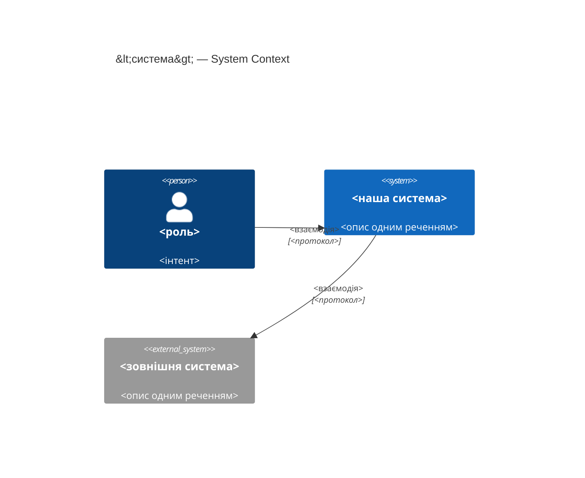
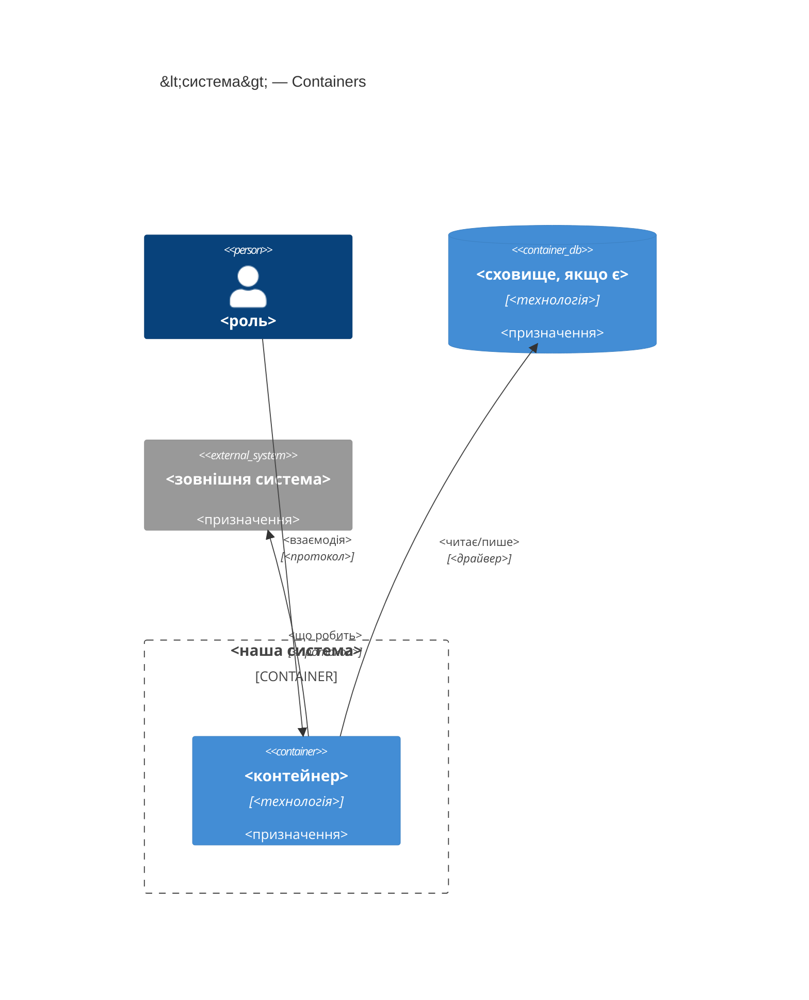
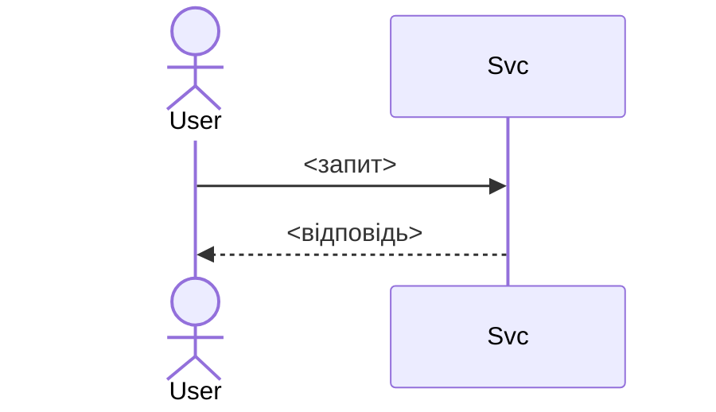

# Software Architecture Document — <slug>

<!-- 12 секцій arc42. Порожня секція — лише <!-- N/A: причина одним реченням -->.
C4 Context (L1) inline у §3. C4 Container (L2) inline у §5.
§6 сіє лише головний потік — решту AC покриє майбутня стадія complete-sequence-diagrams.
Числа в §10 — ДОСЛІВНО з PRD §6 NFR, без округлень і вигадок.
Референс-приклади заповненого документа цього репо: docs/features/tg-assistant/sad.md
(worker, S) і docs/features/rules-change-monitor/sad.md (worker, M, 3 ADR + критик-раунд). -->

## 1. Вступ і цілі

<!-- 1 абзац наміру з PRD §2 Цілі + топ-3 якості (повні сценарії — у §10) + таблиця stakeholders. -->

**Намір.** <один абзац із PRD §Цілі — що будуємо і для кого>

**Топ-3 якості (одним рядком; повні сценарії в §10):**

1. <напр. «Availability — цикл переживає пропущений тиждень» (tg-assistant §1)>
2. <напр. «Accuracy — кожна мітка цитує дійсний rule_id» (rules-change-monitor §1)>
3. <напр. «Обмежена тривалість — цикл ≤N хв»>

**Stakeholders.**

<!-- Соло-проєкт: sign-off — сама роль з CONTEXT.md, не вигадана "Tech Lead" (критик
rules-change-monitor F6 упіймав саме цю помилку — роль без глосарію). Одна роль може
нести дві функції (споживач звіту + затверджує SAD) в одному рядку. -->

| Роль | Інтерес | Sign-off? |
|---|---|---|
| <роль лише з CONTEXT.md> | <що саме зачіпає + чи затверджує SAD> | Так/Ні |

<!-- Decision overrides (¶4) — заповнює резолюція критика на кроці 7, інакше порожньо. -->
<!-- Формат рядка: «Decision override: <заголовок> — rationale: <причина>» -->

## 2. Обмеження

<!-- §4 (стратегія) працює лише коли §2 зафіксувала, ЩО ВЖЕ ЗАФІКСОВАНО — це вхід, не вихід. Ніколи N/A. -->

**Технічні.**
- <мова + версія>
- <якщо тулінг поза app/lib/** — назви конкретний прецедент з architecture-map.md
  «Де що лежить», не вигадуй новий патерн з нуля>
- <сховище даних, якщо є — версія й формат>
- <архітектурна конвенція репо з `docs/architecture-map.md`>

**Організаційні.**
- <бюджет часу, якщо PRD §2 його називає>
- <дедлайн, якщо є — інакше `<TBD by PM>` + рядок у §11>
- Соло-проєкт (`CLAUDE.md`) — склад команди майже завжди «Mike», не вигадувати ролей

**Конвенції.**
- <посилання на CLAUDE.md / конвенції репо>
- <нейминг, ID-стратегія, патерн обробки помилок — цитата з architecture-map.md, не з памʼяті>

**Регуляторні / зовнішні.**
- <з PRD §6.1 Security/privacy — застосовні контролі>
- <ніколи N/A — якщо PRD §6.1 порожній, написати чому>

## 3. Контекст і межі

<!-- Малює МЕЖУ СИСТЕМИ — хто говорить з нею ззовні, де закінчується зона довіри. Ніколи N/A. -->

<2-3 речення бізнес-контексту з PRD §1. Якщо фіча живе поза шаром
presentation→adapters→calc→rules основного застосунку (окремий tooling-скрипт) —
сказати це прямо, як tg-assistant §3 і rules-change-monitor §3.>

**Зовнішні системи (in/out):**

| Актор або система | Тип | Взаємодія |
|---|---|---|
| <роль з CONTEXT.md> | Person | <що робить> |
| <зовнішнє джерело/система> | System (external) | <взаємодія> |
| <внутрішні дані, якими фіча лише користується, не володіє> | System (external) | <читання; хто веде життєвий цикл> |

**C4 Context (L1):**



<!-- greenfield без коду й мапи → <!-- brownfield: N/A — greenfield repo --> замість цитувань конвенцій. -->

## 4. Стратегія рішення

<!-- 3-4 СТРАТЕГІЧНІ СТОВПИ, з яких ростуть ADR. Найгустіша секція — gate спрацьовує майже завжди. -->

**Target surface(s) (перше рішення — що саме будуємо):** `<напр. [worker]>`
<!-- РЕКОМЕНДОВАНІ КОНТЕЙНЕРИ ЦЬОГО РЕПО (не курсовий загальний список):
- Фіча всередині продукту (торкає app/lib/**) → [web-frontend] за замовчуванням.
  Продукт свідомо БЕЗ сервера (DECISIONS 2026-07-28, "розрахунок на клієнті") — [backend-service]
  НЕ дефолт, потребує окремого явного обґрунтування, чому саме ця фіча ламає це рішення.
- Окремий tooling-скрипт поза app/lib (як tg-assistant, rules-change-monitor) →
  [worker] (безнаглядно за розкладом) або [cli] (вручну) — обирати за словом
  "безнаглядно"/"вручну" в PRD US, не навмання.
- [mobile-app]/[desktop-app] — немає жодного прецеденту в цьому репо; перш ніж обирати,
  спитати, чи це справді нова поверхня, а не web-frontend, що PWA-обгорнули.
Дзеркалити обране у frontmatter target_surfaces. Більше однієї поверхні — зазвичай ADR. -->

**Стратегічні вибори (насіння для ADR):**

1. **<стовп 1>** — <2-3 речення rationale з посиланням на Топ-3 якості + Обмеження>.
2. **<стовп 2>** — <2-3 речення>.
3. **<стовп 3>** — <2-3 речення>.

Кожне тактичне рішення в наступних секціях має простежуватись до одного з цих
стовпів. Тактичне рішення, що суперечить стовпу, — червоний прапорець, виносити
в §11.

<!-- Радіус удару — ЧОТИРИ критерії, не три (delta від курсового architecture-design):
див. references/c4-mermaid-syntax.md і SKILL.md §«Радіус удару» цього скіла. -->

## 5. Будівельні блоки

<!-- ВНУТРІШНЯ ДЕКОМПОЗИЦІЯ — модулі, контейнери, БД. Хто з ким може говорити. -->

<1 абзац: для app/lib-фічі — шарова конвенція репо (presentation→adapters→calc→rules,
див. CLAUDE.md «Правило залежностей»), не вигадувати гексагональну без причини. Для
tooling-скрипта — простий pipeline за прецедентом scripts/state-checkpoint/ або
research/tg-mining/, не гексагональна розкладка app/lib заради одного скрипта.>

**Внутрішня декомпозиція:**

```
<app/lib/<модуль>/ (продуктова фіча) АБО scripts/<slug>/ / research/<slug>/ (tooling)>
├── ...
└── <точка входу>
```

**C4 Container (L2):** один `Container` на кожну оголошену `target_surface`.



## 6. Виконання (runtime)

<!-- ПОТІК RUNTIME для 1-2 критичних сценаріїв. Учасники — імена з §5, нових не вигадувати.
Повідомлення семантичні, БЕЗ HTTP-методів/шляхів.
Пастка з критик-раунду rules-change-monitor (F1): якщо §4 виправдовує паузу/rate-limit
"між запитами до ОДНОГО джерела" — намалюй ітерацію (loop...end) по одному джерелу,
не крок-до-різних-учасників, що виглядає схоже, але ілюструє інше. -->

**Критичний потік 1: <назва>**



<!-- Для XS/S — 1 потік достатньо. Для M+ — додати 2-4 (failure-mode, async). -->

**Критичний потік 2: <напр. джерело недоступне>** — <якщо застосовно, інакше N/A>.

## 7. Розгортання

<!-- N/A типово для tooling-скрипта цього репо — немає CI/сервера взагалі (CLAUDE.md).
Формулювання-приклад: "N/A: локальний CLI-скрипт без власного розгортання — запускається
вручну чи через cron, немає сервера/CI в репо". Для app/lib-фічі — Vercel, той самий
деплой-юніт, що весь продукт, теж часто N/A, якщо немає нових env/build-кроків. -->

<Топологія у 2-3 реченнях, якщо не N/A.>

## 8. Наскрізні концепції

<!-- НАСКРІЗНІ ПАТЕРНИ. Дефолт — "успадкувати конвенцію репо" одним питанням, не трьома.
Але якщо PRD NFR явно вимагає способу виміру (лог циклу, метрика) — це МІСЦЕ для
свідомого відходу від дефолту, задокументованого тут-таки, а не мовчазного успадкування
(див. rules-change-monitor §8 — логування замінене на структуроване саме тому, що
§6 NFR цитував "лог циклу" як спосіб виміру трьох метрик). -->

| Концепція | Конвенція | Де визначено |
|---|---|---|
| Логування | <дефолт репо, або свідомий відхід із причиною> | <де саме> |
| Автентифікація | <N/A типово для соло-tooling> | — |
| Обробка помилок | <дефолт репо, з file:line прецедентом> | <file:line> |
| ID-стратегія | <дефолт репо> | <file:line> |
| Інтернаціоналізація | <N/A для tooling; для UI — через t(), нуль кириличних літералів у .tsx> | — |
| Спостережність | <зазвичай N/A — немає CI/сервера> | — |

## 9. Архітектурні рішення

<!-- ЗВОРОТНИЙ ІНДЕКС на adr/. Заповнюється по ходу кроку 6 gate. Назви файлів —
англійською kebab-case, форма РІШЕННЯ (наша конвенція команди, formalized тут,
не курсова default — див. SKILL.md §«ADR-naming»). -->

| # | Назва | Статус | Секція |
|---|---|---|---|
| <NNNN> | <у формі рішення, англійською> | Accepted | §<N> |

ADR-файли — `docs/features/<slug>/adr/NNNN-<title>.md`.

## 10. Вимоги якості

<!-- ДЕРЕВО ЯКОСТЕЙ — кожна ціль з §1 розкладена на When/Then/How-verify. Числа ДОСЛІВНО з PRD §6 NFR.
Пастка з критик-раунду (F1): якщо в PRD §6 є NFR, на який §4/§8 посилаються як на
причину рішення, а в §10 немає жодного QG під нього — критик це зловить. Перевір
самостійно ДО критика: кожен NFR-рядок PRD §6 має або QG тут, або явний рядок §11
чому він не верифікується в цьому проході. -->

**QG-1. <якість>**
- **When:** <умова тригера>
- **Then:** <очікувана поведінка з числом з PRD NFR>
- **How verify:** <тест / метрика / cycle-log — не «інтеграційний тест»>

**QG-2. <якість>**
- **When:** <умова>
- **Then:** <очікувано>
- **How verify:** <як>

**QG-3. <якість>**
- **When:** <умова>
- **Then:** <очікувано>
- **How verify:** <як>

## 11. Ризики та технічний борг

<!-- Збирає ВСЕ, що може зламатись — не лише технічне. Ніколи N/A. -->
<!-- Severity: Low/Medium/High для звичайних ризиків; літерально "Open question" для рядків
     з дії «Винести у відкрите питання» на кроці 6. -->

| Ризик / борг | Серйозність | Мітигація | Власник |
|---|---|---|---|
| <напр. brownfield-геп з architecture-map.md — немає лінтера/CI> | Medium | <мітигація> | <роль з CONTEXT.md> |
| Open architectural decision: <заголовок> | Open question | Resolve before <дата/стадія>; <причина> | <власник> |

**Прийнятий борг (ок для v1, план на потім):**
- <напр. сутність без версіонування — ок для v1>

## 12. Глосарій

<!-- СЛОВНИК ДОМЕНУ. Джерело — CONTEXT.md + терміни, що зʼявились під час Socratic walk. Ніколи N/A. -->

| Термін | Значення |
|---|---|
| <термін з CONTEXT.md> | <значення, дослівно узгоджене з CONTEXT.md — не переказ> |
