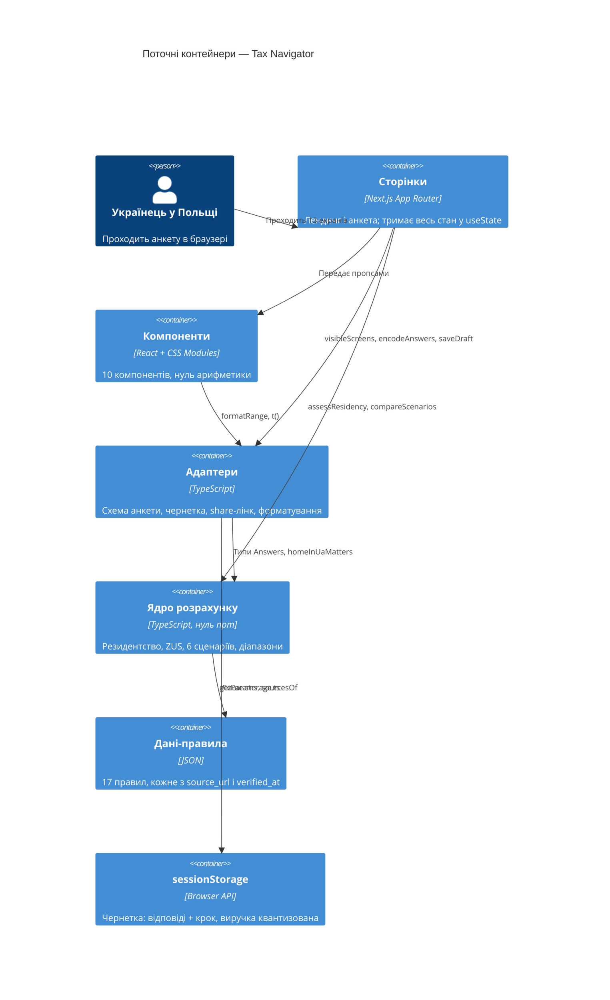

# Карта архітектури — Tax Navigator

> **Поточний** стан (що є сьогодні), згенеровано скілом `map-architecture`.
> Читають наступні стадії SDLC замість того, щоб перескановувати код.
> Оновити, коли репо відійшло від `reflects_commit`.
>
> [ARCHITECTURE.md](../ARCHITECTURE.md) — авторський документ для людини, він **авторитетний** і тут
> не дублюється: ця карта звіряється з ним у секції «Звірка».

## Стек

- Мова: TypeScript `^5.7.0` (`package.json:30`), `strict: true` (`tsconfig.json:7`), таргет ES2017 (`tsconfig.json:3`), аліас `@/* → ./app/*` (`tsconfig.json:22`)
- Фреймворк: Next.js `^15.1.0` App Router (`package.json:16`), React `^19.0.0` (`package.json:17`)
- **Рантайм-залежностей рівно три** — `next`, `react`, `react-dom` (`package.json:15-19`). Нуль UI-бібліотек, нуль CSS-in-JS, нуль стор-менеджерів
- Тести: vitest `^4.1.10` (`package.json:31`), `@testing-library/react` (`package.json:22`), jsdom (`package.json:29`), dependency-cruiser `^18.1.0` (`package.json:28`)
- Команди (`package.json:5-13`): `npm test` → `vitest run && npm run test:arch` (node, лише `*.test.ts`); `npm run test:ui` → окремий jsdom-конфіг (лише `*.test.tsx`); `npm run test:arch` → `depcruise app`; `npm run verify` → `node scripts/verify.mjs`
- `distDir` перемикається через `NEXT_DIST_DIR`, щоб dev і build не ділили `.next` (`next.config.mjs:7`)
- **Лінтера немає** — ні скрипта, ні конфіга. Найближче до нього — `test:arch` + `app/lib/__tests__/architecture.test.ts`

## C4 — система як вона є

Сервера, БД і авторизації немає: нуль route handlers, нуль server actions
(`SPEC.md:21-22`, [ADR-0002](adr/0002-client-side-computation.md)).

## Інвентар модулів

| Модуль | Шлях | Шар | Де зшивається | Відповідальність |
|---|---|---|---|---|
| Дані-правила | `app/lib/rules/rules.2026.json` | rules | — | 17 правил; шапка `tax_year/profile/verified_at` (`:2-4`) |
| Доступ до правил | `app/lib/rules/types.ts` | rules | — | `getRule`/`getParams`/`sourcesOf` (`:26,32,48`); кидає на невідомий `rule_id` (`:28`) |
| Політика діапазонів | `app/lib/calc/range.ts` | calc | — | `UNCERTAINTY.ARITHMETIC=0.04`/`ESTIMATE=0.1` (`:13-16`), `toRange` (`:18`) |
| Квантизація доходу | `app/lib/calc/quantize.ts` | calc | `storage.ts:2`, `schema.ts:3`, `Question.tsx:4` | `snapToStep` (`:27`), `quantizeRevenue` (`:34`), константи кроку 2 500 (`:14-16`) — єдине джерело |
| Резидентство | `app/lib/calc/residency.ts` | calc | `app/questionnaire/page.tsx:130` | `assessResidency` (`:13`), `homeInUaMatters` (`:63`), тай-брейки (`:77`) |
| ZUS | `app/lib/calc/zus.ts` | calc | `jdg.ts:39` | 4 етапи у фіксованому пріоритеті (`:28-67`) |
| Сценарії | `app/lib/calc/scenarios/` | calc | `app/questionnaire/page.tsx:131` | Фасад `compareScenarios`, порядок `[fop, jdg, incubator, nierejestrowana, zlecenie, uop]` (`index.ts:17-26`) |
| Схема анкети | `app/lib/questions/schema.ts` | adapters | `app/questionnaire/page.tsx:48` | **13 екранів** (`:48-265`), `visibleScreens` (`:275`), `resumeIndex` (`:294`) |
| Чернетка | `app/lib/storage.ts` | adapters | `app/questionnaire/page.tsx:44-46` | Ключ `tax-navigator:draft` (`:4`); SSR-guard + try/catch (`:19,24`) |
| Share-лінк | `app/lib/share.ts` | adapters | `app/questionnaire/page.tsx:32` | `encodeAnswers` (`:21`), `decodeAnswers` (`:33`), мапа коротких ключів (`:4-19`) |
| Форматування | `app/lib/format.ts` | adapters | 3 компоненти | `Intl.NumberFormat('uk-UA')` (`:3-5`); нуль імпортів |
| Тексти | `app/lib/i18n/uk.ts` | див. §Звірка п.1 | 12 імпортерів | 153 ключі (`:2-194`), `t()` з fallback на ключ (`:196-198`) |
| Компоненти | `app/components/` | presentation | `app/questionnaire/page.tsx:104,136-144` | 10 штук, кожен зі своїм `.module.css` |
| Сторінки | `app/page.tsx`, `app/questionnaire/page.tsx` | presentation | `app/layout.tsx` | Лендинг (server) і анкета (client, `:20`) |

## Конвенції (цитовані — правила, яким має відповідати нова фіча)

- **Формат даних-правил:** `rule_id` (крапкова ієрархія `домен.підтема.аспект`) + `params` + `source_url` + `verified_at` — `app/lib/rules/rules.2026.json:44-57`. Метаполя snake_case, усередині `params` camelCase (`:8,40,84`). Відкритий верхній tier = `null` (`:51`), читається як «остання смуга» (`app/lib/calc/scenarios/jdg.ts:91`). Інваріант «кожне правило має джерело» перевіряється `app/lib/calc/__tests__/rules.test.ts:5-10`
- **Типізація `params` — на місці споживання, не в `rules/`:** локальні `interface *Params` у файлі сценарію (`app/lib/calc/scenarios/uop.ts:6-31`)
- **Крайні випадки — три різні шаблони:** недоступність замість числа (`rangeMonthly: null` + `unavailableReasonKey`, `jdg.ts:66-68`); кламп арифметики (`Math.max(0, …)`, `shared.ts:26`, `jdg.ts:105`); порожній набір → `null`, не `Infinity` (`shared.ts:32`)
- **Ідентифікатори:** `ScenarioId` (`calc/types.ts:52`) → файл `scenarios/<id>.ts` → експорт `calc<Pascal>` → i18n-ключ `scenario.<id>` (`i18n/uk.ts:142-147`). Екрани анкети — camelCase `id`, а `name` поля збігається з ключем `Answers` (`schema.ts:23`)
- **Пізнє зв'язування через рядки:** calc повертає **ключі** i18n, не тексти (`fop.ts:19-24`, `zus.ts:34,47`), UI резолвить через `t()` (`ScenarioCard.tsx:25,80-82`). Частина ключів будується динамічно — `` t(`zus.stage.${zus.stage}`) `` (`jdg.ts:39`). **Типами це не перевіряється** — головне джерело тихих поломок при перейменуванні
- **Тести:** `describe` описує правило, `it` містить очікуване число просто в заголовку (`benchmark.test.ts:32-34`). Еталон звіряється з **центром смуги** — `exact(range)` + `toBeCloseTo`, не `rangeContains` (`benchmark.test.ts:11-18`): смуга ±4% це продуктове рішення, а не допуск для арифметики. Спільні дані — `baseAnswers` + `withAnswers(patch)` (`__tests__/fixtures.ts:4,22`). Два різні еталони живуть поруч: ручний вивід із норми (`benchmark.test.ts:20-27`, джерело — `docs/EVIDENCE.md §6`) і відповідь державного калькулятора ZUS у фікстурі (`zus-state.test.ts:8-19`, збирає `scripts/fetch-zus-benchmark.mjs`)
- **Стилі — варіанти через `data-*`, не класи-модифікатори:** `data-variant="primary"` (`app/page.tsx:44`) → `button[data-variant='primary']` (`globals.css:174`); те саме `data-risk` (`RiskBadge.tsx:24`), `data-empty` (`ComparisonTable.tsx:54`)
- **Локалізація:** усі тексти для людини — через `t()`, у `.tsx` немає кириличних літералів. З 2026-07-29 це **машинна** межа, не дисципліна: скан у `app/lib/__tests__/architecture.test.ts`

## Сховища даних

| Сховище | Рушій | Доступ через | Нотатки |
|---|---|---|---|
| Чернетка анкети | `window.sessionStorage` | `app/lib/storage.ts:25` | Єдиний ключ `tax-navigator:draft`; **не** localStorage |
| Share-лінк | URL query | `app/lib/share.ts:21,33` | Вхідний канал теж: має пріоритет над чернеткою (`app/questionnaire/page.tsx:32-36`) |
| БД | — | — | Немає. `.env.example:8` містить `DATABASE_URL` із позначкою «у FREE-зрізі не використовується» (`:6-7`) |

**Що свідомо не зберігається:** точна виручка. Квантизується до кроку 2 500 перед
записом (`storage.ts:23`) і перед потраплянням у лінк (`share.ts:29`). Тести
приватності: `storage.test.ts:32-37` (17342 → 17500), `share.test.ts:7-11,19-24`
(два різні доходи в одному кроці дають однаковий лінк), `flow.test.tsx:226-228`.

## Фронтенд / UI-фундамент

- **Дизайн-токени:** `app/globals.css`, імпортується рівно один раз (`app/layout.tsx:2`). Групи: поверхні й чорнило (`:12-19`), teal-акцент `#0f766e` (`:22-26`), статуси ризику (`:29-31`), типографіка `--text-xs…2xl` (`:34-45`), відступи `--space-1…7` (`:48-54`), радіуси (`:57-59`), тіні (`:62-63`). Темна тема — окремий набір, не інверсія (`:69-91`). Плаваючий rem: `clamp(16px, 15px + 0.35vw, 18px)` (`:99`)
- **Підхід до стилів:** CSS Modules, один файл на компонент — 11 файлів, разом 725 рядків. Імпорт незмінно `import styles from './X.module.css'`
- **Спільні примітиви — чесна картина:**
  - `RiskBadge` (`RiskBadge.tsx:18`) і `SourceCitation` (`SourceCitation.tsx:7`) — **єдині два реально перевикористовувані** компоненти
  - Кнопка — глобальний елементний стиль (`globals.css:158-189`), React-компонента `Button` **немає**: сторінки пишуть голий `<button data-variant>`
  - **Примітиву картки немає.** Однаковий набір `--surface` + `--hairline` + радіус + `--shadow-sm` продубльовано в п'яти місцях: `ComparisonTable.module.css:1-8`, `ResidencyVerdict.module.css:1-2`, `Question.module.css:1-6`, `app/page.module.css:1-9`, `questionnaire/page.module.css:46-54`. З 2026-08-04 картка сценарію свого фону вже НЕ має — рамку й радіус тримає спільний контейнер `.cards`, а `ScenarioCard.module.css:7-10` лишає тільки лінійку між сусідами
  - Слайдер — узагальнений, керується `SliderConfig` (`schema.ts:12-20`), обслуговує дві осі (виручка `:159-166`, дні `:74`), має `openEnded` для «+» (`Question.tsx:88`)
  - Акордеон — на нативному `
` (`ScenarioCard.tsx:28`), в окремий примітив не витягнутий
  - Таблиць дві незалежні: порівняльна (`ComparisonTable.tsx:30-82`) і таблиця підформ (`ScenarioCard.tsx:69-93`)
- **A11y-конвенції наскрізні:** видимий фокус глобально (`globals.css:153-156`), мінімум 44px на клікабельних (`globals.css:166`), `prefers-reduced-motion` у 4 файлах, `aria-live="polite"` на результаті (`app/questionnaire/page.tsx:134`)
- **Найближчий прецедент екрана:** результатний — `Result` (`app/questionnaire/page.tsx:119-163`); простий статичний — `app/page.tsx:30-52`; інтерактивний кроковий — `Question` (`Question.tsx:18-29`)

## Де що лежить / найближчі прецеденти

- **Новий сценарій розрахунку** → `app/lib/calc/scenarios/<id>.ts`, за зразком `uop.ts` (найповніший: локальні `*Params` `:6-12`, читання правил на початку `:41-45`, річна арифметика ÷12 `:60-63`, повернення з `toRange` + `risk` + `noteKeys` + `sourcesOf` `:67-76`). Реєстрація у фасаді — `scenarios/index.ts:5,12,15`. Пара-тест з еталоном у назві — `benchmark.test.ts:71-79`. Сценарій із підформами → `jdg.ts:31-51`; сценарій свідомо без числа → `fop.ts:18-49`
- **Нове питання анкети** → `schema.ts`, за зразком екрана `jdgHistory` (`:249-264`). Чекліст із нього: поле в `Answers` (`calc/types.ts:39`) → екран у `SCREENS` → `showIf` → ключі в `uk.ts` (`:94-97`) → якщо їде в лінк, коротка літера в `KEYS` (`share.ts:17`) і для булевого — `BOOLEAN_KEYS` (`:49`) → тест на умовність (`questions.test.ts:35-48`) + оновити лічильники екранів (`:6-15`). Складніший прецедент, де `showIf` виведено з логіки калькуляції, — `homeInUa` (`schema.ts:130-143`) + `homeInUaMatters` (`residency.ts:63-70`)
- **Новий екран** → складається з наявних примітивів (§Фронтенд), за зразком `Result` (`app/questionnaire/page.tsx:119-163`)
- **Нова картка-компонент** → `app/components/`, за зразком `ResidencyVerdict.tsx:6-38` + однойменний `.module.css`

## Обмеження й відомий технічний борг

- **Ядро без npm-залежностей** — `calc/` мусить рахуватись у голому Node. Енфорситься `core-no-external` (`.dependency-cruiser.cjs:21-31`); правило свого часу було привидом через `exclude: node_modules`, фікс — `doNotFollow`
- **Браузерні API лише в `storage.ts`** — у межах `app/lib/**`. Скан обмежений цим шляхом (`architecture.test.ts:15`) з allowlist на один файл (`:18`) і антипротуханням allowlist (`:46-55`)
- **Ключі i18n не типізовані** — динамічні шаблони (`` t(`risk.jdg.formerEmployer.${…}`) ``, `jdg.ts:46`) не ловляться ні `tsc`, ні depcruise. Перейменування ключа падає мовчки в рантаймі, `t()` віддає сам ключ (`uk.ts:166-169`)
- **Квантизація виручки — одне джерело** (`app/lib/calc/quantize.ts`), слайдер і сховище звертаються до нього. Анти-регрес `calc/__tests__/quantize.test.ts` падає, щойно межі слайдера розійдуться з константами
- **Ворота G2 не пройдені** — закріплено 1 калібрувальний профіль, потрібно 10 проти держкалькуляторів (`SPEC.md:46`). Движок не вважається готовим
- **Сценарій ФОП: український тягар є, польське «на руки» — ні** (`fop.ts:31-32`). ЄСВ/ВЗ звірені 2026-07-29, тож `foreignBurden` віддає дві величини в різних валютах і **не** складає їх — курс UAH→PLN не застосовуємо (DECISIONS 2026-07-29). `rangeMonthly` лишається `null`, поки не звірені складки ZUS саме для `zakład`
- **Лінтера і CI немає** — CI заплановано з Module 9 (`CLAUDE.md:74`)
- **`next build` у контейнері заборонено** (`.claude/rules/environment-limits.md`) — перевірка через `tsc --noEmit` + `npm test` + `npm run test:ui`

## Звірка з `ARCHITECTURE.md`

Документ прочитано як авторитетний вхід. Збігається в головному: шари, напрямок
залежностей, машинна перевірка меж. Розходження — нижче; вони **не виправлялись
мовчки**, а спершу були названі. Три з них закриті того ж дня, за рішенням Mike:
позначені ✅ з тим, що саме зроблено.

1. **`i18n/` класифікується по-різному в документі й у конфізі.** `ARCHITECTURE.md:20` відносить `app/lib/i18n/` до presentation; `.dependency-cruiser.cjs:16` включає його в регексп `ADAPTERS`, а `PRESENTATION` (`:18`) його не покриває. Практичного розходження немає — `core-no-adapters` (`:33-39`) однаково забороняє ядру імпортувати i18n. **Частково закрито:** «відоме зміщення» в `ARCHITECTURE.md:72-76` тепер це прямо згадує; сама подвійна класифікація лишається.
2. ✅ **Квантизація була дубльована, а не лише «не в тому шарі».** Крім `share.ts`, та сама логіка існувала окремою реалізацією в `snap()` слайдера, з іншим джерелом меж — тобто продуктове рішення про приватність трималось у двох місцях. **Закрито:** усе переїхало в `app/lib/calc/quantize.ts` (спрацював тригер, записаний у самому `ARCHITECTURE.md`), слайдер тепер кличе `snapToStep`, а `calc/__tests__/quantize.test.ts` падає, щойно межі розійдуться.
3. ✅ **«У компонентах немає рядків-літералів» не виконувалось.** `app/layout.tsx` показував користувачу `title: "Tax Navigator"` повз `t()`, тоді як `uk.ts` містив іншу назву — два різні заголовки продукту. І це було єдине правило таблиці, яке не перевірялось нічим. **Закрито:** метадані беруться з `t()` (`app/layout.tsx:9-12`), закріплено конвенцію «українська — для людей, Tax Navigator — технічна», а скан кириличних літералів у всіх `.tsx` додано в `app/lib/__tests__/architecture.test.ts` і доведено навмисною поломкою.
4. ✅ **Кількість тестів була застаріла у двох файлах** (`ARCHITECTURE.md`, `docs/adr/0001-…`) — казали 71. **Закрито:** обидва оновлені до 86.
5. **Тести адаптерів лежать у теці ядра.** `share.test.ts`, `storage.test.ts`, `questions.test.ts` тестують adapters, але лежать під `app/lib/calc/__tests__/`. Формально не порушення (правила мають `pathNot: '__tests__'`), проте розкладка суперечить карті шарів.
6. **«Браузерні API лише в `storage.ts`» ширше за реальне правило.** Presentation вільно користується браузером: `window.location`, `window.history`, `navigator.clipboard` (`app/questionnaire/page.tsx:32,73,79`). Це узгоджено з енфорсментом (скан обмежений `app/lib`), але формулювання документа цього не звужує.
7. **Дрібне:** стале посилання в коментарі `calc/types.ts:38` (`'from6to24'` проти реального `'from6to30'`, `:16`); назва тесту `residency.test.ts:79` не збігається з асертом (`:84`); токен `--measure: 66ch` (`globals.css:45`) не використовується ніде.
