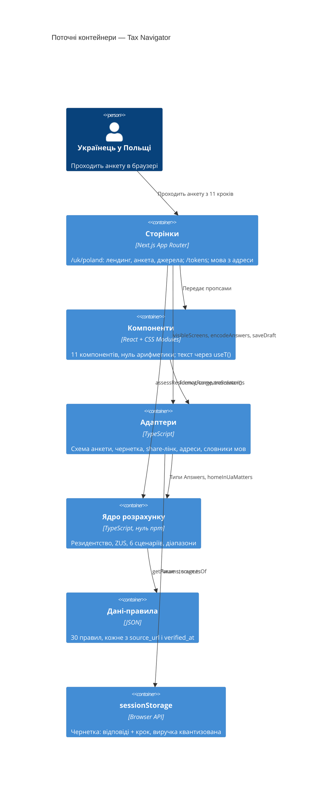

# Карта архітектури — Tax Navigator

> **Поточний** стан (що є сьогодні), згенеровано скілом `map-architecture`.
> Читають наступні стадії SDLC замість того, щоб перескановувати код.
> Оновити, коли репо відійшло від `reflects_commit`.
>
> [ARCHITECTURE.md](../ARCHITECTURE.md) — авторський документ для людини, він **авторитетний** і тут
> не дублюється: ця карта звіряється з ним у секції «Звірка».

## Стек

- Мова: TypeScript `^5.7.0` (`package.json:33`), `strict: true` (`tsconfig.json:7`), таргет ES2017 (`tsconfig.json:3`), аліас `@/* → ./app/*` (`tsconfig.json:22`)
- Фреймворк: Next.js `^15.1.0` App Router (`package.json:17`), React `^19.0.0` (`package.json:18`)
- **Рантайм-залежностей рівно три** — `next`, `react`, `react-dom` (`package.json:17-21`). Нуль UI-бібліотек, нуль CSS-in-JS, нуль стор-менеджерів
- Тести: vitest `^4.1.10` (`package.json:34`), `@testing-library/react` (`package.json:25`), jsdom (`package.json:32`), dependency-cruiser `^18.1.0` (`package.json:31`), Playwright `^1.62.1` (`package.json:23`)
- Команди (`package.json:5-15`): `npm test` → `vitest run && npm run test:arch` (node, `app/**/*.test.ts` + `scripts/**/*.test.mjs`); `npm run test:ui` → окремий jsdom-конфіг (лише `*.test.tsx`); `npm run test:arch` → `depcruise app`; `npm run test:visual` → Playwright-матриця скріншотів (**лише на CI** — браузера в контейнері немає); `npm run verify` → `node scripts/verify.mjs`; `npm run ports` → показує порти цього worktree
- `npm run dev` і `npm run start` ідуть через `scripts/worktree-ports.mjs`: порт виводиться з worktree, головний лишається на 3000 (`package.json:6`, `package.json:8`)
- `distDir` перемикається через `NEXT_DIST_DIR`, щоб dev і build не ділили `.next` (`next.config.mjs:21`); там же редиректи старих адрес (`next.config.mjs:30`) і `experimental.globalNotFound` (`next.config.mjs:27`) — [ADR-0003](adr/0003-locale-country-routes.md)
- **Лінтера немає** — ні скрипта, ні конфіга. Найближче до нього — `test:arch` + `app/lib/__tests__/architecture.test.ts`

## C4 — система як вона є

```mermaid
C4Container
    title Поточні контейнери — Tax Navigator
    Person(user, "Українець у Польщі", "Проходить анкету в браузері")
    Container(pages, "Сторінки", "Next.js App Router", "/uk/poland: лендинг, анкета, джерела; /tokens; мова з адреси")
    Container(components, "Компоненти", "React + CSS Modules", "11 компонентів, нуль арифметики; текст через useT()")
    Container(adapters, "Адаптери", "TypeScript", "Схема анкети, чернетка, share-лінк, адреси, словники мов")
    Container(calc, "Ядро розрахунку", "TypeScript, нуль npm", "Резидентство, ZUS, 6 сценаріїв, діапазони")
    Container(rules, "Дані-правила", "JSON", "30 правил, кожне з source_url і verified_at")
    Container(browser, "sessionStorage", "Browser API", "Чернетка: відповіді + крок, виручка квантизована")
    Rel(user, pages, "Проходить анкету з 11 кроків")
    Rel(pages, components, "Передає пропсами")
    Rel(pages, calc, "assessResidency, compareScenarios")
    Rel(pages, adapters, "visibleScreens, encodeAnswers, saveDraft")
    Rel(components, adapters, "formatRange, translator()")
    Rel(adapters, calc, "Типи Answers, homeInUaMatters")
    Rel(adapters, browser, "Лише storage.ts")
    Rel(calc, rules, "getParams, sourcesOf")
```

Сервера, БД і авторизації немає: нуль route handlers, нуль server actions; email
листу очікування йде у зовнішню форму звичайним посиланням (`app/lib/waitlist.ts`)
(`SPEC.md:21-23`, [ADR-0002](adr/0002-client-side-computation.md)).

## Інвентар модулів

| Модуль | Шлях | Шар | Де зшивається | Відповідальність |
|---|---|---|---|---|
| Дані-правила | `app/lib/rules/rules.2026.json` | rules | — | 30 правил; шапка `tax_year/profile/verified_at` (`:2-4`) |
| Доступ до правил | `app/lib/rules/types.ts` | rules | — | `getRule`/`getParams`/`sourcesOf` (`:26,32,48`); кидає на невідомий `rule_id` (`:28`) |
| Політика діапазонів | `app/lib/calc/range.ts` | calc | — | `UNCERTAINTY.ARITHMETIC=0.04`/`ESTIMATE=0.1` (`:13-16`), `toRange` (`:18`) |
| Квантизація доходу | `app/lib/calc/quantize.ts` | calc | `storage.ts:2`, `schema.ts:3`, `Question.tsx:6` | `snapToStep` (`:27`), `quantizeRevenue` (`:34`), константи кроку 2 500 (`:14-16`) — єдине джерело |
| Резидентство | `app/lib/calc/residency.ts` | calc | `app/[locale]/poland/questionnaire/Questionnaire.tsx:140` | `assessResidency` (`:13`), `homeInUaMatters` (`:63`), тай-брейки (`:77`) |
| ZUS | `app/lib/calc/zus.ts` | calc | `jdg.ts:39` | 4 етапи у фіксованому пріоритеті (`:28-67`) |
| Право працювати | `app/lib/calc/status.ts` | calc | `scenarios/status-gate.ts` | `assessStatus` (`:82`): доступ до кожної форми за підставою перебування з `rule_id` (`BASIS_TO_RULE_CODE`, `:48`) |
| Свіжість звірки | `app/lib/calc/freshness.ts` | calc | `app/lib/sources.ts` | `STALE_AFTER_DAYS` (`:11`), `isStale` (`:23`) |
| Сценарії | `app/lib/calc/scenarios/` | calc | `app/[locale]/poland/questionnaire/Questionnaire.tsx:141` | Фасад `compareScenarios`, порядок `[fop, jdg, incubator, nierejestrowana, zlecenie, uop]` (`scenarios/index.ts:17-26`) |
| Схема анкети | `app/lib/questions/schema.ts` | adapters | `app/[locale]/poland/questionnaire/Questionnaire.tsx:56` | **13 екранів** (`:48-265`), `visibleScreens` (`:275`), `resumeIndex` (`:294`) |
| Чернетка | `app/lib/storage.ts` | adapters | `app/[locale]/poland/questionnaire/Questionnaire.tsx:45` | Ключ `tax-navigator:draft` (`:4`); SSR-guard + try/catch (`:19,24`) |
| Share-лінк | `app/lib/share.ts` | adapters | `app/[locale]/poland/questionnaire/Questionnaire.tsx:40` | `encodeAnswers` (`:21`), `decodeAnswers` (`:33`), мапа коротких ключів (`:4-19`) |
| Форматування | `app/lib/format.ts` | adapters | 3 компоненти | `Intl.NumberFormat('uk-UA')` (`:3-5`); нуль імпортів |
| Каталог джерел | `app/lib/sources.ts` | adapters | `app/[locale]/poland/sources/page.tsx:53` | `buildSourceCatalog` (`:49`), порядок груп `GROUP_ORDER` (`:16`) |
| Адреси | `app/lib/routes.ts` | adapters | сторінки, `next.config.mjs` | `countryHref` (`:14`), старі редиректи `LEGACY_REDIRECTS` (`:24`), canonical + hreflang `alternates` (`:36`) |
| Базова адреса | `app/lib/site.ts` | adapters | `app/[locale]/layout.tsx` | `siteUrl(env)` (`:8`): `NEXT_PUBLIC_APP_URL` → прод Vercel → localhost |
| Мови | `app/lib/i18n/index.ts` | див. §Звірка п.1 | layout-и, `I18nProvider.tsx` | Реєстр `DICTIONARIES` (`:12`) — увімкнені мови; `translator` (`:25`). Словник `uk.ts` (246 ключів), каркас `en.ts` (порожній, не увімкнений), `createT` з fallback на ключ (`translate.ts:8`) |
| Компоненти | `app/components/` | presentation | `app/[locale]/poland/questionnaire/Questionnaire.tsx:146-153` | 11 штук + `I18nProvider` (`useT` `:23`, `useLocale` `:27`); текстові — `'use client'` |
| Сторінки | `app/[locale]/poland/{page,questionnaire/page,sources/page}.tsx`, `app/(technical)/tokens/page.tsx` | presentation | `app/[locale]/layout.tsx`, `app/(technical)/layout.tsx` | Лендинг і джерела (server, мова з `params`), анкета (server-обгортка заради метаданих + клієнтський `Questionnaire.tsx:27`); 404 — `app/global-not-found.tsx` |

## Конвенції (цитовані — правила, яким має відповідати нова фіча)

- **Формат даних-правил:** `rule_id` (крапкова ієрархія `домен.підтема.аспект`) + `params` + `source_url` + `verified_at` — `app/lib/rules/rules.2026.json:44-57`. Метаполя snake_case, усередині `params` camelCase (`:8,40,84`). Відкритий верхній tier = `null` (`:51`), читається як «остання смуга» (`app/lib/calc/scenarios/jdg.ts:91`). Інваріант «кожне правило має джерело» перевіряється `app/lib/calc/__tests__/rules.test.ts:5-10`
- **Типізація `params` — на місці споживання, не в `rules/`:** локальні `interface *Params` у файлі сценарію (`app/lib/calc/scenarios/uop.ts:6-31`)
- **Крайні випадки — три різні шаблони:** недоступність замість числа (`rangeMonthly: null` + `unavailableReasonKey`, `jdg.ts:66-68`); кламп арифметики (`Math.max(0, …)`, `shared.ts:26`, `jdg.ts:105`); порожній набір → `null`, не `Infinity` (`shared.ts:32`)
- **Ідентифікатори:** `ScenarioId` (`calc/types.ts:52`) → файл `scenarios/<id>.ts` → експорт `calc<Pascal>` → i18n-ключ `scenario.<id>` (`i18n/uk.ts:210-215`). Екрани анкети — camelCase `id`, а `name` поля збігається з ключем `Answers` (`schema.ts:23`)
- **Пізнє зв'язування через рядки:** calc повертає **ключі** i18n, не тексти (`fop.ts:19-24`, `zus.ts:34,47`), UI резолвить через `t()` з `useT()` (`ScenarioCard.tsx:27`). Частина ключів будується динамічно — `` t(`zus.stage.${zus.stage}`) `` (`jdg.ts:39`). **Типами це не перевіряється** — головне джерело тихих поломок при перейменуванні
- **Тести:** `describe` описує правило, `it` містить очікуване число просто в заголовку (`benchmark.test.ts:32-34`). Еталон звіряється з **центром смуги** — `exact(range)` + `toBeCloseTo`, не `rangeContains` (`benchmark.test.ts:11-18`): смуга ±4% це продуктове рішення, а не допуск для арифметики. Спільні дані — `baseAnswers` + `withAnswers(patch)` (`__tests__/fixtures.ts:4,22`). Два різні еталони живуть поруч: ручний вивід із норми (`benchmark.test.ts:20-27`, джерело — `docs/EVIDENCE.md §6`) і відповідь державного калькулятора ZUS у фікстурі (`zus-state.test.ts:8-19`, збирає `scripts/fetch-zus-benchmark.mjs`)
- **Стилі — варіанти через `data-*`, не класи-модифікатори:** `data-variant="primary"` (`app/[locale]/poland/page.tsx:54`) → `button[data-variant='primary']` (`globals.css:231`); те саме `data-risk` (`RiskBadge.tsx:27`), `data-empty` (`ComparisonTable.tsx:57`)
- **Локалізація:** усі тексти для людини — через `t()`, у `.tsx` немає кириличних літералів. З 2026-07-29 це **машинна** межа, не дисципліна: скан у `app/lib/__tests__/architecture.test.ts`. З 2026-10-03 `t` береться з мови адреси: компонент — `useT()`, серверна сторінка — `translator(locale)`; прямий імпорт `i18n/uk` поза `(technical)` ловить `app/lib/__tests__/i18n-locales.test.ts`, повноту кожної увімкненої мови — той самий файл
- **Посилання між сторінками** — лише `countryHref(locale, …)` (`app/lib/routes.ts:14`), не рядок `/questionnaire`

## Сховища даних

| Сховище | Рушій | Доступ через | Нотатки |
|---|---|---|---|
| Чернетка анкети | `window.sessionStorage` | `app/lib/storage.ts:25` | Єдиний ключ `tax-navigator:draft`; **не** localStorage |
| Share-лінк | URL query | `app/lib/share.ts:21,33` | Вхідний канал теж: має пріоритет над чернеткою (`app/[locale]/poland/questionnaire/Questionnaire.tsx:40-41`); шлях лінка — поточна адреса з мовою (`app/[locale]/poland/questionnaire/Questionnaire.tsx:87`) |
| БД | — | — | Немає. Серверна БД лише Postgres і лише під платний tier або waitlist; `DATABASE_URL` прибрано з `.env.example` (DECISIONS 2026-09-16) |

**Що свідомо не зберігається:** точна виручка. Квантизується до кроку 2 500 перед
записом (`storage.ts:23`) і перед потраплянням у лінк (`share.ts:29`). Тести
приватності: `storage.test.ts:32-37` (17342 → 17500), `share.test.ts:7-11,19-24`
(два різні доходи в одному кроці дають однаковий лінк), `flow.test.tsx:231-233`.

## Фронтенд / UI-фундамент

- **Дизайн-токени:** `app/globals.css`, імпортується кожним кореневим layout — `app/[locale]/layout.tsx:2`, `app/(technical)/layout.tsx:1` — і `app/global-not-found.tsx:2`. Колір двома шарами: палітра `--stone-*`/`--teal-*`/статусні з сирим hex (`:16-53`), ролі лише через `var()` на палітру — поверхні й чорнило (`:60-67`), teal-акцент (`:70-74`), статуси ризику (`:77-79`); межу шарів тримає `app/__tests__/design-tokens.test.ts`. Шкали без ролей: типографіка `--text-xs…2xl` і `--font-mono` (`:86-99`), відступи `--space-1…7` (`:102-108`), радіуси (`:111-113`), тіні (`:118-119`). Темна тема перевизначає лише ролі, не інверсія (`:126-148`). Плаваючий rem: `clamp(16px, 15px + 0.35vw, 18px)` (`:156`). Сторінка `/tokens` показує словник, читаючи цей файл під час збірки (`app/lib/tokens.ts`)
- **Підхід до стилів:** CSS Modules, один файл на компонент — 11 файлів, разом 725 рядків. Імпорт незмінно `import styles from './X.module.css'`
- **Спільні примітиви — чесна картина:**
  - `RiskBadge` (`RiskBadge.tsx:20`) і `SourceCitation` (`SourceCitation.tsx:9`) — **єдині два реально перевикористовувані** компоненти
  - Кнопка — глобальний елементний стиль (`globals.css:215-246`), React-компонента `Button` **немає**: сторінки пишуть голий `<button data-variant>`
  - **Примітиву картки немає.** Однаковий набір `--surface` + `--hairline` + радіус + `--shadow-sm` продубльовано в п'яти місцях: `ComparisonTable.module.css:1-8`, `ResidencyVerdict.module.css:1-2`, `Question.module.css:1-6`, `app/[locale]/poland/page.module.css:1-12`, `questionnaire/page.module.css:53-61`. З 2026-08-04 картка сценарію свого фону вже НЕ має — рамку й радіус тримає спільний контейнер `.cards`, а `ScenarioCard.module.css:7-10` лишає тільки лінійку між сусідами
  - Слайдер — узагальнений, керується `SliderConfig` (`schema.ts:12-20`), обслуговує дві осі (виручка `:159-166`, дні `:74`), має `openEnded` для «+» (`Question.tsx:92`)
  - Акордеон — на нативному `
` (`ScenarioCard.tsx:32`), в окремий примітив не витягнутий
  - Таблиць дві незалежні: порівняльна (`ComparisonTable.tsx:33-86`) і таблиця підформ (`ScenarioCard.tsx:73-97`)
- **A11y-конвенції наскрізні:** видимий фокус глобально (`globals.css:210-213`), мінімум 44px на клікабельних (`globals.css:223`), `prefers-reduced-motion` у 4 файлах, `aria-live="polite"` на результаті (`app/[locale]/poland/questionnaire/Questionnaire.tsx:144`)
- **Найближчий прецедент екрана:** результатний — `Result` (`app/[locale]/poland/questionnaire/Questionnaire.tsx:127-177`); простий статичний — `app/[locale]/poland/page.tsx:37-66`; інтерактивний кроковий — `Question` (`Question.tsx:18-30`)

## Де що лежить / найближчі прецеденти

- **Новий сценарій розрахунку** → `app/lib/calc/scenarios/<id>.ts`, за зразком `uop.ts` (найповніший: локальні `*Params` `:6-12`, читання правил на початку `:41-45`, річна арифметика ÷12 `:60-63`, повернення з `toRange` + `risk` + `noteKeys` + `sourcesOf` `:67-76`). Реєстрація у фасаді — `scenarios/index.ts:5,12,15`. Пара-тест з еталоном у назві — `benchmark.test.ts:71-79`. Сценарій із підформами → `jdg.ts:54-89`; сценарій свідомо без числа → `fop.ts:18-49`
- **Нове питання анкети** → `schema.ts`, за зразком екрана `jdgHistory` (`:249-264`). Чекліст із нього: поле в `Answers` (`calc/types.ts:49`) → екран у `SCREENS` → `showIf` → ключі в `uk.ts` (`:114-117`) → якщо їде в лінк, коротка літера в `KEYS` (`share.ts:24`) і для булевого — `BOOLEAN_KEYS` (`:49`) → тест на умовність (`questions.test.ts:36-49`) + оновити лічильники екранів (`:6-15`). Складніший прецедент, де `showIf` виведено з логіки калькуляції, — `homeInUa` (`schema.ts:131-144`) + `homeInUaMatters` (`residency.ts:63-70`)
- **Новий екран** → складається з наявних примітивів (§Фронтенд), за зразком `Result` (`app/[locale]/poland/questionnaire/Questionnaire.tsx:127-177`)
- **Нова сторінка країни** → `app/[locale]/poland/<назва>/page.tsx` з `generateMetadata` → `alternates(locale, …)`, значення в `CountryPage` (`app/lib/routes.ts:12`); серверна бере `translator(await resolveLocale(params))` (`app/[locale]/params.ts`), за зразком `app/[locale]/poland/sources/page.tsx`
- **Нова мова** → словник у `app/lib/i18n/` + рядок у `DICTIONARIES` (`app/lib/i18n/index.ts:12`); маршрути не правляться (ADR-0003)
- **Нова картка-компонент** → `app/components/`, за зразком `ResidencyVerdict.tsx:8-41` + однойменний `.module.css`

## Обмеження й відомий технічний борг

- **Ядро без npm-залежностей** — `calc/` мусить рахуватись у голому Node. Енфорситься `core-no-external` (`.dependency-cruiser.cjs:26-34`); правило свого часу було привидом через `exclude: node_modules`, фікс — `doNotFollow`
- **Браузерні API лише в `storage.ts`** — у межах `app/lib/**`. Скан обмежений цим шляхом (`architecture.test.ts:15`) з allowlist на один файл (`:18`) і антипротуханням allowlist (`:46-55`)
- **Ключі i18n не типізовані** — динамічні шаблони (`` t(`risk.jdg.formerEmployer.${…}`) ``, `jdg.ts:49`) не ловляться ні `tsc`, ні depcruise. Перейменування ключа падає мовчки в рантаймі, `t()` віддає сам ключ (`translate.ts:10`)
- **Квантизація виручки — одне джерело** (`app/lib/calc/quantize.ts`), слайдер і сховище звертаються до нього. Анти-регрес `calc/__tests__/quantize.test.ts` падає, щойно межі слайдера розійдуться з константами
- **Сценарій ФОП: український тягар є, польське «на руки» — ні** (`fop.ts:31-32`). ЄСВ/ВЗ звірені 2026-07-29, тож `foreignBurden` віддає дві величини в різних валютах і **не** складає їх — курс UAH→PLN не застосовуємо (DECISIONS 2026-07-29). `rangeMonthly` лишається `null`, поки не звірені складки ZUS саме для `zakład`
- **Лінтера немає; CI не запускає `npm run verify`** — у `.github/workflows/` `claude.yml` (відповідь на `@claude`), `visual.yml` (скріншоти екранів), `release.yml`, `deploy-tg-collector.yml` і `tg-collector-oncall.yml`; зелений гейт лишається локальним кроком перед комітом. PR-флоу кодифіковано секцією `## Pull requests` (`CLAUDE.md:81`)
- **`next build` у контейнері заборонено** (`.claude/rules/environment-limits.md`) — перевірка через `tsc --noEmit` + `npm test` + `npm run test:ui`

## Звірка з `ARCHITECTURE.md`

Документ прочитано як авторитетний вхід. Збігається в головному: шари, напрямок
залежностей, машинна перевірка меж. Розходження — нижче; вони **не виправлялись
мовчки**, а спершу були названі. Шість із семи закриті, за рішенням Mike:
позначені ✅ з тим, що саме зроблено. Лишається п.5 — свідомо не в цьому заході
(тести адаптерів у не тій теці закриваються окремою кодовою зміною).

1. ✅ **`i18n/` класифікується по-різному в документі й у конфізі.** `ARCHITECTURE.md:20` відносить `app/lib/i18n/` до presentation; `.dependency-cruiser.cjs:16` включає його в регексп `ADAPTERS`, а `PRESENTATION` (`:22`) його не покриває. Практичного розходження немає — `core-no-adapters` (`:33-39`) однаково забороняє ядру імпортувати i18n. **Закрито:** «відоме зміщення» в `ARCHITECTURE.md:78-87` тепер прямо називає це свідомим компромісом (файл лежить під `app/lib/**`, тож шляховий регексп конфіга кладе його в `ADAPTERS`; документ класифікує по ролі), а не забутою розбіжністю — з поясненням, чому уніфікація коштує дорожче за практичний ефект. Сама подвійна назва лишається навмисно.
2. ✅ **Квантизація була дубльована, а не лише «не в тому шарі».** Крім `share.ts`, та сама логіка існувала окремою реалізацією в `snap()` слайдера, з іншим джерелом меж — тобто продуктове рішення про приватність трималось у двох місцях. **Закрито:** усе переїхало в `app/lib/calc/quantize.ts` (спрацював тригер, записаний у самому `ARCHITECTURE.md`), слайдер тепер кличе `snapToStep`, а `calc/__tests__/quantize.test.ts` падає, щойно межі розійдуться.
3. ✅ **«У компонентах немає рядків-літералів» не виконувалось.** `app/layout.tsx` показував користувачу `title: "Tax Navigator"` повз `t()`, тоді як `uk.ts` містив іншу назву — два різні заголовки продукту. І це було єдине правило таблиці, яке не перевірялось нічим. **Закрито:** метадані беруться з `t()` (з 2026-10-03 — `generateMetadata` у `app/[locale]/layout.tsx:24`, разом з OpenGraph), закріплено конвенцію «українська — для людей, Tax Navigator — технічна», а скан кириличних літералів у всіх `.tsx` додано в `app/lib/__tests__/architecture.test.ts` і доведено навмисною поломкою.
4. ✅ **Кількість тестів була застаріла у двох файлах** (`ARCHITECTURE.md`, `docs/adr/0001-…`) — казали 71. **Закрито:** обидва оновлені до 86.
5. **Тести адаптерів лежать у теці ядра.** `share.test.ts`, `storage.test.ts`, `questions.test.ts` тестують adapters, але лежать під `app/lib/calc/__tests__/`. Формально не порушення (правила мають `pathNot: '__tests__'`), проте розкладка суперечить карті шарів.
6. ✅ **«Браузерні API лише в `storage.ts`» ширше за реальне правило.** Presentation вільно користується браузером: `window.location`, `window.history`, `navigator.clipboard` (`app/[locale]/poland/questionnaire/Questionnaire.tsx:40,81,87`). Це було узгоджено з енфорсментом (скан обмежений `app/lib`), але формулювання документа цього не звужувало. **Закрито:** `ARCHITECTURE.md:35-39` тепер явно каже, що правило про `storage.ts` діє лише в межах `app/lib/**`, і називає конкретні браузерні виклики, якими presentation вільно користується напряму.
7. ✅ **Дрібне:** стале посилання в коментарі `calc/types.ts:48` (`'from6to24'` проти реального `'from6to30'`, `:16`); назва тесту `residency.test.ts:79` не збігається з асертом (`:84`); токен `--measure: 66ch` (`globals.css`, рядок 45 на момент виявлення) не використовується ніде. **Закрито:** коментар у `app/lib/calc/types.ts:48` виправлено на `'from6to30'`; тест у `residency.test.ts:79` перейменовано на «житло в обох країнах, нічия по центру інтересів → вирішує звичайне перебування (дні)» (сама поведінка й асерт на `:84` — правильні, назва не відповідала їм); `--measure` видалено з `globals.css` — grep підтвердив нуль інших входжень.
