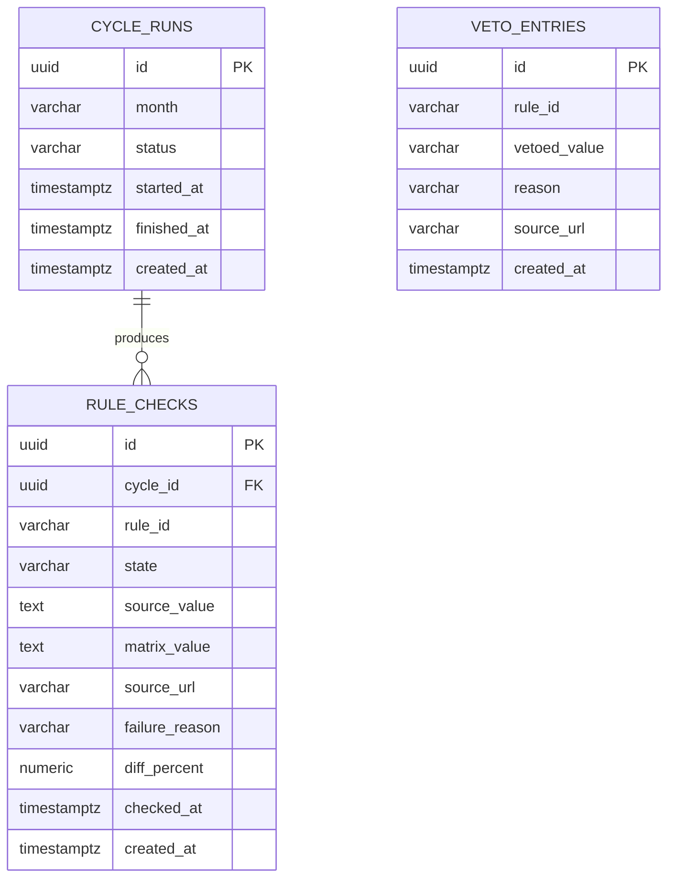

# Data model — rules-change-monitor

<!-- Generated per generate-data-model protocol (skill run manually — SKILL.md, unvendored).
Migrations are STAGED under docs/features/rules-change-monitor/migrations/ (NOT a live
migrations/ tree — цей репо його не має, docs/architecture-map.md §Сховища даних: «БД — Немає»).
Ця модель — навчальний прогін пайплайна уроку 6.5, не заміна ADR-0002 (state.json). -->

## ER diagram

`veto_entries` не має FK-зв'язку з `rule_checks`/`cycle_runs` — це ручний, довготривалий
список (PRD §8: «поповнюється вручну при кожному новому інциденті»), звіряється по
`rule_id` як текстовий пошук, не через реляційний зв'язок.

## Entities

### `cycle_runs`

| Column | Type | Constraints | Notes |
|---|---|---|---|
| `id` | UUID | PK, app-generated (UUID v7) | |
| `month` | VARCHAR(7) | NOT NULL, UNIQUE | `YYYY-MM` — ключ ідемпотентності циклу |
| `status` | VARCHAR(32) | NOT NULL | `completed` \| `partial` — enum-in-app |
| `started_at` | TIMESTAMPTZ | NOT NULL | |
| `finished_at` | TIMESTAMPTZ | NULL | NULL, доки цикл не завершено |
| `created_at` | TIMESTAMPTZ | NOT NULL DEFAULT now() | |

**Aggregate root:** root (`rule_checks` — дочірня).
**Access patterns:** «чи цей місяць уже оброблено» → UNIQUE на `month` вже btree-індекс.
**Constraints:** UNIQUE на `month`.

### `rule_checks`

| Column | Type | Constraints | Notes |
|---|---|---|---|
| `id` | UUID | PK, app-generated (UUID v7) | |
| `cycle_id` | UUID | NOT NULL, FK → `cycle_runs(id)` | індексовано нижче |
| `rule_id` | VARCHAR(64) | NOT NULL | той самий `rule_id`, що в `rules.2026.json` |
| `state` | VARCHAR(32) | NOT NULL | один із 7 станів AC-03, enum-in-app |
| `source_value` | TEXT | NULL | сире значення джерела; NULL при «не вдалось перевірити» |
| `matrix_value` | TEXT | NOT NULL | значення матриці на момент звірки |
| `source_url` | VARCHAR(255) | NOT NULL | |
| `failure_reason` | VARCHAR(255) | NULL | заповнено лише при «не вдалось перевірити» (AC-08) |
| `diff_percent` | NUMERIC(6,2) | NULL | наскільки джерело відрізняється від матриці, %; заповнено лише коли `state` — розбіжність (AC-04/05) |
| `checked_at` | TIMESTAMPTZ | NOT NULL | момент звірки цього запису |
| `created_at` | TIMESTAMPTZ | NOT NULL DEFAULT now() | |

<!-- 2026-08-10: `diff_percent` додано навмисно для симуляції розходження при прогоні
api-forge --reconcile (лекція api-forge, складний рівень). Ще без staged-міграції —
це робота generate-data-model, поза межами цього прогону; api-forge лише читає модель,
не породжує SQL. -->

**Aggregate root:** `cycle_runs` (FK `cycle_id`).
**Access patterns:**
- «звіт: усі розбіжності цього циклу» (AC-06) → `idx_rule_checks_cycle_id`.
- «історія цього запису через цикли — чи повторити невдалий» (AC-09, Потік 2) → `idx_rule_checks_rule_id`.
**Constraints:** FK → `cycle_runs(id)`.

<!-- Why: без updated_at — кожен rule_check рядок належить рівно одному циклу й ніколи не
переписується заднім числом, тому AC-06 (звіт не переглядається постфактум) закривається
самою відсутністю updated_at, а не окремою логікою. -->

### `veto_entries`

| Column | Type | Constraints | Notes |
|---|---|---|---|
| `id` | UUID | PK, app-generated (UUID v7) | |
| `rule_id` | VARCHAR(64) | NOT NULL | |
| `vetoed_value` | VARCHAR(255) | NOT NULL | скасована/ветована цифра (напр. ставка reformy zdrowotnej) |
| `reason` | VARCHAR(255) | NOT NULL | коротке пояснення (посилання на інцидент) |
| `source_url` | VARCHAR(255) | NOT NULL | |
| `created_at` | TIMESTAMPTZ | NOT NULL DEFAULT now() | |

**Aggregate root:** root.
**Access patterns:** «чи нове значення джерела збігається з відомою ветованою цифрою для
цього rule_id» (AC-10, Потік 3) → `idx_veto_entries_rule_id`.
**Constraints:** немає FK — ручний список, не похідний від `rule_checks`.

## Indexes

| Index | Columns | Query it serves |
|---|---|---|
| `idx_rule_checks_cycle_id` | `rule_checks(cycle_id)` | звіт циклу (AC-06); обов'язковий FK-індекс (self-check) |
| `idx_rule_checks_rule_id` | `rule_checks(rule_id)` | історія запису через цикли — чи повторити невдалу перевірку (AC-09) |
| `idx_veto_entries_rule_id` | `veto_entries(rule_id)` | veto-перевірка при класифікації (AC-10, Потік 3) |

## Test fixtures

<!-- Проєкт не має ORM/тестового DB-шару (client-only, vitest) — фабрики описані як план. -->

- `newCycleRun(overrides?)` — цикл зі `status: 'completed'`.
- `newRuleCheck(cycleId, overrides?)` — перевірка зі `state: 'matches'` за замовчуванням.
- `newVetoEntry(overrides?)` — ветований запис із фейковим `rule_id`.

PII guard: дані — публічні державні ставки, PII немає (PRD §6.1). Seed-даних не потрібно
(немає bootstrap/lookup-таблиць для цієї фічі).
