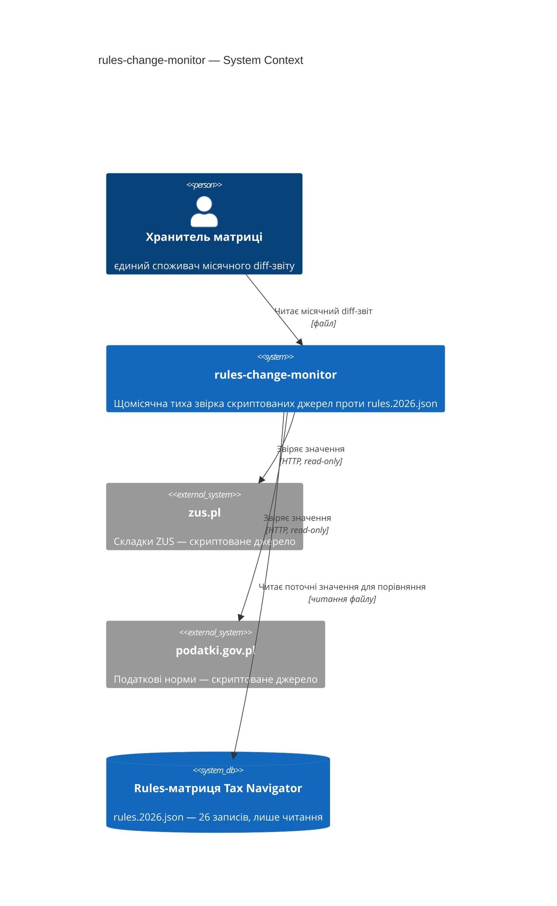
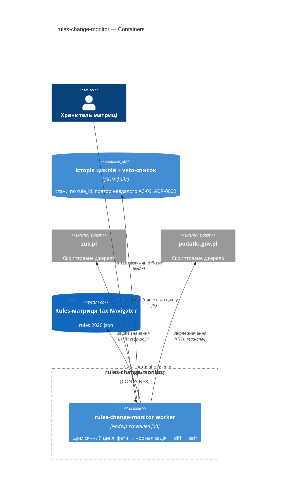
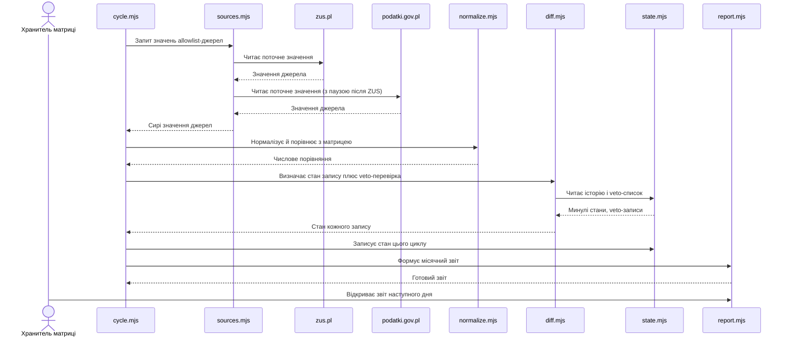
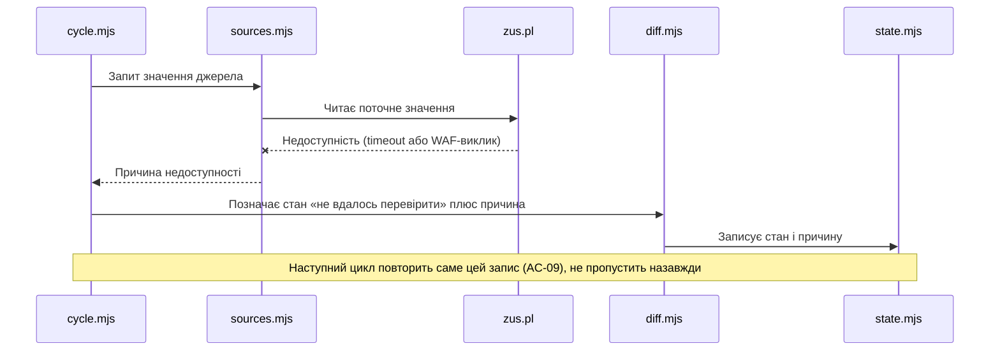

# Software Architecture Document — rules-change-monitor

<!-- 12 секцій arc42. Порожня секція — лише <!-- N/A: причина одним реченням -->.
C4 Context (L1) inline у §3. C4 Container (L2) inline у §5.
§6 сіє лише головний потік — решту AC покриє майбутня стадія complete-sequence-diagrams.
Числа в §10 — ДОСЛІВНО з PRD §6 NFR, без округлень і вигадок. -->

## 1. Вступ і цілі

<!-- 1 абзац наміру з PRD §2 Цілі + топ-3 якості (повні сценарії — у §10) + таблиця stakeholders. -->

**Намір.** Автоматична, тиха, безкоштовна щомісячна звірка скриптованих
джерел (`zus.pl`, `podatki.gov.pl`) проти `rules.2026.json` — захищає
безкоштовне порівняння й платний план дій від помилки ручного читання (та
сама категорія, що переплутана норма KUP, 2026-08-03), без персональних
алертів (v2, поза межами) і без покриття джерел за WAF.

**Топ-3 якості (одним рядком; повні сценарії в §10):**

1. **Accuracy** — ≤1 хибнопозитивна «розбіжність» через форматування на цикл (§6 NFR, §7 KPI).
2. **Availability** — ≥90% місяців зі звітом без ручного перезапуску, ковзне 12-місячне вікно (§6 NFR).
3. **Обмежена тривалість** — цикл звірки ≤15 хв, огляд звіту Хранителем ≤30 хв (§6 NFR, §7 KPI-1).

**Stakeholders.**

| Роль | Інтерес | Sign-off? |
|---|---|---|
| Хранитель матриці | Єдиний споживач щомісячного звіту | Ні |
| Tech Lead | Затвердження SAD | Так |

<!-- Decision overrides (¶4) — заповнює резолюція критика на кроці 7, інакше порожньо. -->
<!-- Формат рядка: «Decision override: <заголовок> — rationale: <причина>» -->

## 2. Обмеження

<!-- §4 (стратегія) працює лише коли §2 зафіксувала, ЩО ВЖЕ ЗАФІКСОВАНО — це вхід, не вихід. Ніколи N/A. -->

**Технічні.**
- Node.js ESM CLI-скрипт — той самий патерн, що `scripts/check-stale-rules.mjs` і `scripts/fetch-zus-benchmark.mjs` (обидва поза `app/lib/**`)
- Читає `rules.2026.json` напряму (шлях `app/lib/rules/rules.2026.json`), той самий формат-інваріант, що `app/lib/rules/types.ts`
- **`fetch-zus-benchmark.mjs` вже б'є 11 послідовних HTTP-запитів без паузи** (`scripts/fetch-zus-benchmark.mjs:117-121`) — PRD §6.1 abuse case прямо вимагає паузу між запитами до одного джерела, тож цей наявний патерн **не можна перевикористати як є**, паузу треба побудувати

**Організаційні.**
- Соло (Хранитель матриці)
- Дедлайн до G3 (вересень-жовтень 2026, PRD §1)
- Бюджет часу не названий у PRD → `<TBD by PM>`, рядок у §11

**Конвенції.**
- Allowlist доменів має збігатися в `.devcontainer/init-firewall.sh` і `.claude/settings.json` — розбіжність валить `npm run verify` (`CLAUDE.md`)
- Стан правила — похідна величина з дати, не окреме поле (патерн `check-stale-rules.mjs`); ця фіча розширює той самий підхід від пасивного віку до активної звірки зі значенням джерела

**Регуляторні / зовнішні.**
- PRD §6.1: Internal (публічні державні ставки, не персональні дані), без PII
- Немає нової authz-межі — AC-02 це межа домену (allowlist джерел), не особи

## 3. Контекст і межі

<!-- Малює МЕЖУ СИСТЕМИ — хто говорить з нею ззовні, де закінчується зона довіри. Ніколи N/A. -->

rules-change-monitor — окремий Node CLI-інструмент поза шаром
presentation→adapters→calc→rules основного застосунку. Щомісяця звіряє
`zus.pl` і `podatki.gov.pl` проти `rules.2026.json` і видає diff-звіт;
ніколи не пише в саму матрицю (PRD §3 — поза межами).

**Зовнішні системи (in/out):**

| Актор або система | Тип | Взаємодія |
|---|---|---|
| Хранитель матриці | Person | Читає місячний diff-звіт |
| `zus.pl` | System (external) | Скриптоване джерело — складки ZUS |
| `podatki.gov.pl` | System (external) | Скриптоване джерело — податкові норми |
| Rules-матриця Tax Navigator | System (external) | Читання для звірки; життєвий цикл веде `/scaffold-rule`, не ця фіча |

**C4 Context (L1):**



<!-- greenfield без коду й мапи → <!-- brownfield: N/A — greenfield repo --> замість цитувань конвенцій. -->

## 4. Стратегія рішення

<!-- 3-4 СТРАТЕГІЧНІ СТОВПИ, з яких ростуть ADR. Найгустіша секція — gate спрацьовує майже завжди. -->

**Target surface(s) (перше рішення — що саме будуємо):** `[worker]`
<!-- Scheduled job без request/response і без UI — точно матчить "раз на місяць скрипт
автоматично звіряє" з US-01. Радіус удару 1/3 (лише чесна альтернатива — cli), gate не
спрацьовує, рішення лишається inline. -->

**Стратегічні вибори (насіння для ADR):**

1. **Нормалізація → порівняння чисел для diff-детектора** — парсити число з тексту джерела, потім порівнювати числове значення з матрицею; розрізняє «косметика» (AC-04) від «розбіжність» (AC-05). Радіус удару 2/3 (мультимодульно: diff-детектор + звіт + veto-перевірка; чесна альтернатива: raw string diff) → [ADR-0001](adr/0001-normalize-then-compare-numeric-values.md).
2. **Пауза між запитами до одного джерела** — фіксована затримка, а не адаптивний backoff; закриває abuse case з PRD §6.1, якого наявний прецедент (`fetch-zus-benchmark.mjs`) не покриває (§2). Радіус удару 1/3 (лише чесна альтернатива) — межовий, свідомо лишено **inline**, не ADR: тактична деталь одного шару fetch, не архітектурна розвилка.
3. **Локальний JSON-файл для історії циклів і veto-списку** — без нього AC-09 (повторити невдале) і AC-10 (веto відомих скасованих цифр) не працюють узагалі. Радіус удару 3/3 (незворотнє, мультимодульно, чесна альтернатива — SQLite) → [ADR-0002](adr/0002-local-json-file-for-cycle-history-and-veto-list.md).
4. **Власний allowlist-масив у скрипті, не парсинг `init-firewall.sh`** — allowlist автозвірки (AC-02) семантично вужчий за firewall-allowlist (мережевий доступ ≠ підтверджена скриптована доступність, PRD §8). Радіус удару 2/3 (мультимодульно: firewall-конфіг + `.claude/settings.json` + цей скрипт; чесна альтернатива: parse-from-firewall) → [ADR-0003](adr/0003-own-allowlist-in-script-not-parsed-from-firewall-config.md).

Кожне тактичне рішення в наступних секціях має простежуватись до одного з цих
стовпів. Тактичне рішення, що суперечить стовпу, — червоний прапорець, виносити
в §11.

## 5. Будівельні блоки

<!-- ВНУТРІШНЯ ДЕКОМПОЗИЦІЯ — модулі, контейнери, БД. Хто з ким може говорити. -->

Простий pipeline, той самий рівень, що `scripts/state-checkpoint/` — не
гексагональна розкладка з `app/lib`. Одна поверхня (`worker`), одна команда
запуску за розкладом. Шість модулів-файлів, кожен відповідає за одне
архітектурне рішення з §4 (ADR-0001/0002/0003 + паузу-стовп + report), не
змішані в один файл, як `check-stale-rules.mjs` (там простіше — одне
вирахування зі стану, тут — чотири окремі рішення).

**Внутрішня декомпозиція:**

```
scripts/rules-change-monitor/
├── allowlist.mjs   <власний список доменів автозвірки (ADR-0003)>
├── sources.mjs       <фетч zus.pl/podatki.gov.pl, пауза між запитами (§4 стовп 2)>
├── normalize.mjs       <нормалізація → порівняння чисел (ADR-0001)>
├── diff.mjs               <присвоює один із 7 станів AC-03, звіряє з veto-списком AC-10>
├── state.mjs                 <читає/пише cycle-history.json (ADR-0002)>
├── report.mjs                   <збирає місячний звіт (AC-06/AC-07)>
└── cycle.mjs                       <self-wiring — точка входу для cron>
```

**C4 Container (L2):** одна оголошена `target_surface` → один `Container`.



## 6. Виконання (runtime)

<!-- ПОТІК RUNTIME для 1-2 критичних сценаріїв. Учасники — імена з §5, нових не вигадувати.
Повідомлення семантичні, БЕЗ HTTP-методів/шляхів — це територія майбутнього api-forge.
Цей скіл сіє лише головний потік; повне покриття кожного AC — окрема майбутня стадія. -->

**Критичний потік 1: місячний цикл, happy path (AC-01, AC-03, AC-04/05, AC-06)**



**Критичний потік 2: джерело недоступне (AC-08, AC-09)**



## 7. Розгортання

<!-- ТОПОЛОГІЯ — скільки реплік, де живе фоновий обробник, при яких числах масштабуємось.
N/A допустимо для XS/S, що переюзає наявне розгортання без змін. -->

<!-- N/A: локальний CLI-скрипт без власного розгортання — запускається вручну чи
через cron на машині Хранителя матриці, немає сервера/CI в репо (CLAUDE.md).
Немає реплік, порогів масштабування чи окремого моніторингу для опису. -->

## 8. Наскрізні концепції

<!-- НАСКРІЗНІ ПАТЕРНИ через кілька модулів: логування, помилки, авторизація, ID-стратегія, кеш.
Патерн всередині одного модуля — не сюди. Конвенція проєкту в цілому — у CLAUDE.md, не тут. -->

| Концепція | Конвенція | Де визначено |
|---|---|---|
| Логування | <напр. структуроване, поля `module=<name>`> | <CLAUDE.md §X або тут> |
| Автентифікація | <напр. сесія / JWT> | <CLAUDE.md §X> |
| Обробка помилок | <sentinel → ports → JSON-мапінг> | <CLAUDE.md §X> |
| ID-стратегія | <UUID v7 / auto-increment> | <CLAUDE.md §X> |
| Інтернаціоналізація | <напр. N/A, лише UA> | — |
| Спостережність | <метрики/трасування, якщо є> | — |

## 9. Архітектурні рішення

<!-- ЗВОРОТНИЙ ІНДЕКС на adr/. Один рядок на ADR. Заповнюється по ходу кроку 6 gate, не тут заздалегідь. -->

| # | Назва | Статус | Секція |
|---|---|---|---|
| 0001 | Normalize then compare numeric values for diff detection | Accepted | §4 |
| 0002 | Local JSON file for cycle history and the veto list | Accepted | §4 |
| 0003 | Own allowlist array in the script instead of parsing firewall config | Accepted | §4 |

ADR-файли — `docs/features/rules-change-monitor/adr/NNNN-<title>.md`.

<!-- N/A допустимо лише якщо жодне рішення не спрацювало на gate (типово для XS): <!-- N/A: no decisions crossed blast-radius threshold --> -->

## 10. Вимоги якості

<!-- ДЕРЕВО ЯКОСТЕЙ — кожна ціль з §1 розкладена на When/Then/How-verify. Числа ДОСЛІВНО з PRD §6 NFR. -->

**QG-1. <якість>**
- **When:** <умова тригера>
- **Then:** <очікувана поведінка з числом з PRD NFR>
- **How verify:** <тест / навантажувальний прогін / метрика — не «інтеграційний тест»>

**QG-2. <якість>**
- **When:** <умова>
- **Then:** <очікувано>
- **How verify:** <як>

**QG-3. <якість>**
- **When:** <умова>
- **Then:** <очікувано>
- **How verify:** <як>

## 11. Ризики та технічний борг

<!-- Збирає ВСЕ, що може зламатись — не лише технічне. Ніколи N/A. -->
<!-- Severity: Low/Medium/High для звичайних ризиків; літерально "Open question" для рядків
     з дії «Винести у відкрите питання» на кроці 6. -->

| Ризик / борг | Серйозність | Мітигація | Власник |
|---|---|---|---|
| <напр. затримка outbox під час збою даунстріму> | Medium | <алерт, план дій, retry> | <роль> |
| Open architectural decision: <заголовок> | Open question | Resolve before <дата/стадія>; <причина> | <власник> |

**Прийнятий борг (ок для v1, план на потім):**
- <напр. сутність без версіонування — ок для v1>

## 12. Глосарій

<!-- СЛОВНИК ДОМЕНУ. Джерело — CONTEXT.md + терміни, що зʼявились під час Socratic walk. Ніколи N/A. -->

| Термін | Значення |
|---|---|
| <термін з CONTEXT.md> | <значення> |
