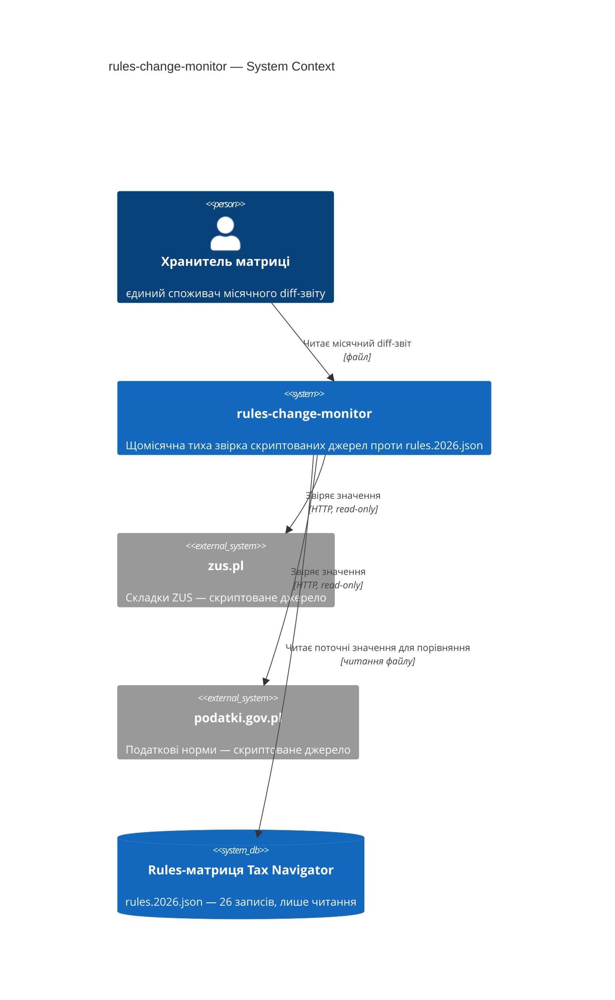
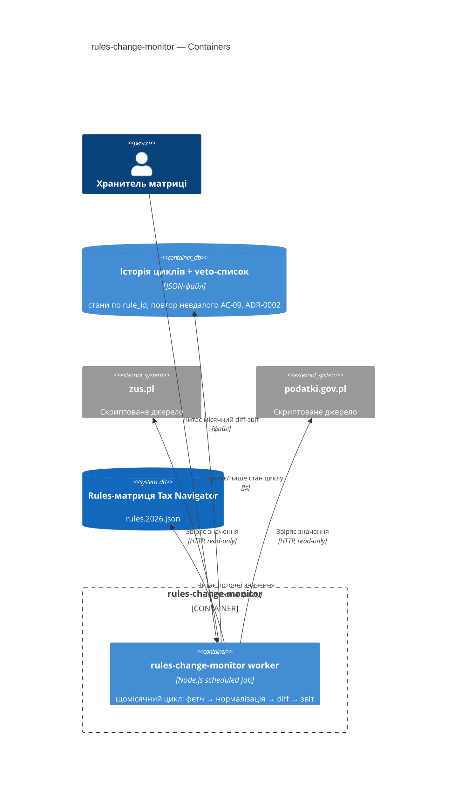
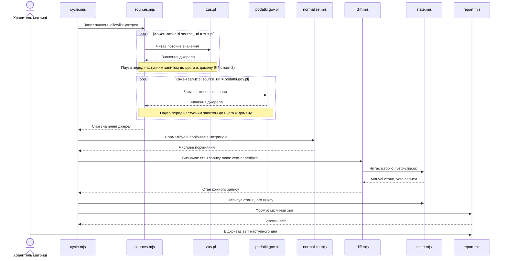
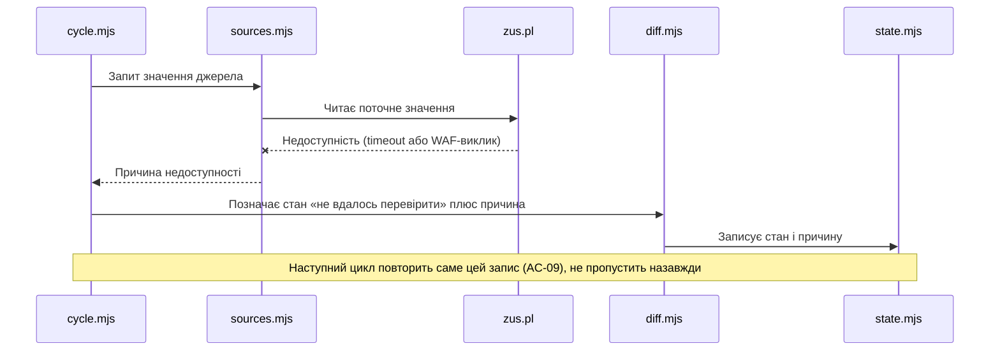
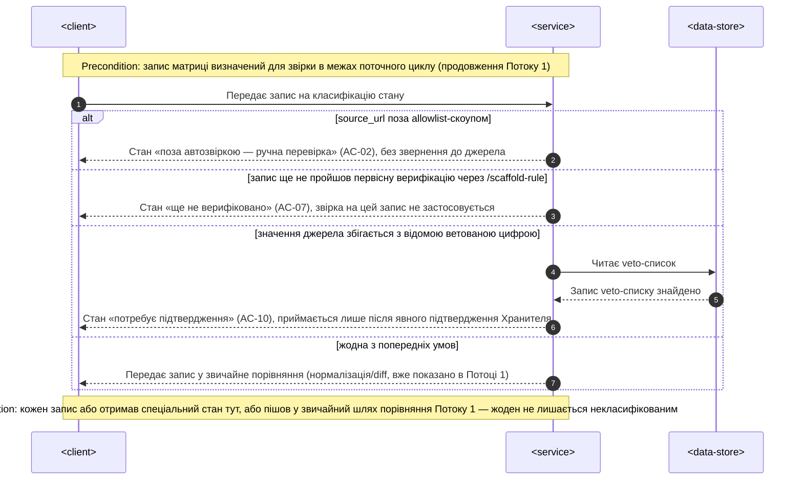

# Software Architecture Document — rules-change-monitor

<!-- 12 секцій arc42. Порожня секція — лише <!-- N/A: причина одним реченням -->.
C4 Context (L1) inline у §3. C4 Container (L2) inline у §5.
§6 сіє лише головний потік — решту AC покриє майбутня стадія complete-sequence-diagrams.
Числа в §10 — ДОСЛІВНО з PRD §6 NFR, без округлень і вигадок. -->

## 1. Вступ і цілі

<!-- 1 абзац наміру з PRD §2 Цілі + топ-3 якості (повні сценарії — у §10) + таблиця stakeholders. -->

**Намір.** Автоматична, тиха, безкоштовна щомісячна звірка скриптованих
джерел (`zus.pl`, `podatki.gov.pl`) проти `rules.2026.json` — захищає
безкоштовне порівняння й платний план дій від помилки ручного читання (та
сама категорія, що переплутана норма KUP, 2026-08-03), без персональних
алертів (v2, поза межами) і без покриття джерел за WAF.

**Топ-3 якості (одним рядком; повні сценарії в §10):**

1. **Accuracy** — ≤1 хибнопозитивна «розбіжність» через форматування на цикл (§6 NFR, §7 KPI).
2. **Availability** — ≥90% місяців зі звітом без ручного перезапуску, ковзне 12-місячне вікно (§6 NFR).
3. **Обмежена тривалість** — цикл звірки ≤15 хв, огляд звіту Хранителем ≤30 хв (§6 NFR, §7 KPI-1).

**Stakeholders.**

| Роль | Інтерес | Sign-off? |
|---|---|---|
| Хранитель матриці | Єдиний споживач щомісячного звіту + затверджує SAD | Так |

<!-- Decision overrides (¶4) — заповнює резолюція критика на кроці 7, інакше порожньо. -->
<!-- Формат рядка: «Decision override: <заголовок> — rationale: <причина>» -->

## 2. Обмеження

<!-- §4 (стратегія) працює лише коли §2 зафіксувала, ЩО ВЖЕ ЗАФІКСОВАНО — це вхід, не вихід. Ніколи N/A. -->

**Технічні.**
- Node.js ESM CLI-скрипт — той самий патерн, що `scripts/check-stale-rules.mjs` і `scripts/fetch-zus-benchmark.mjs` (обидва поза `app/lib/**`)
- Читає `rules.2026.json` напряму (шлях `app/lib/rules/rules.2026.json`), той самий формат-інваріант, що `app/lib/rules/types.ts`
- **`fetch-zus-benchmark.mjs` вже б'є 11 послідовних HTTP-запитів без паузи** (`scripts/fetch-zus-benchmark.mjs:117-121`) — PRD §6.1 abuse case прямо вимагає паузу між запитами до одного джерела, тож цей наявний патерн **не можна перевикористати як є**, паузу треба побудувати

**Організаційні.**
- Соло (Хранитель матриці)
- Дедлайн до G3 (вересень-жовтень 2026, PRD §1)
- Бюджет часу не названий у PRD → `<TBD by PM>`, рядок у §11

**Конвенції.**
- Allowlist доменів має збігатися в `.devcontainer/init-firewall.sh` і `.claude/settings.json` — розбіжність валить `npm run verify` (`CLAUDE.md`)
- Стан правила — похідна величина з дати, не окреме поле (патерн `check-stale-rules.mjs`); ця фіча розширює той самий підхід від пасивного віку до активної звірки зі значенням джерела

**Регуляторні / зовнішні.**
- PRD §6.1: Internal (публічні державні ставки, не персональні дані), без PII
- Немає нової authz-межі — AC-02 це межа домену (allowlist джерел), не особи

## 3. Контекст і межі

<!-- Малює МЕЖУ СИСТЕМИ — хто говорить з нею ззовні, де закінчується зона довіри. Ніколи N/A. -->

rules-change-monitor — окремий Node CLI-інструмент поза шаром
presentation→adapters→calc→rules основного застосунку. Щомісяця звіряє
`zus.pl` і `podatki.gov.pl` проти `rules.2026.json` і видає diff-звіт;
ніколи не пише в саму матрицю (PRD §3 — поза межами).

**Зовнішні системи (in/out):**

| Актор або система | Тип | Взаємодія |
|---|---|---|
| Хранитель матриці | Person | Читає місячний diff-звіт |
| `zus.pl` | System (external) | Скриптоване джерело — складки ZUS |
| `podatki.gov.pl` | System (external) | Скриптоване джерело — податкові норми |
| Rules-матриця Tax Navigator | System (external) | Читання для звірки; життєвий цикл веде `/scaffold-rule`, не ця фіча |

**C4 Context (L1):**



<!-- greenfield без коду й мапи → <!-- brownfield: N/A — greenfield repo --> замість цитувань конвенцій. -->

## 4. Стратегія рішення

<!-- 3-4 СТРАТЕГІЧНІ СТОВПИ, з яких ростуть ADR. Найгустіша секція — gate спрацьовує майже завжди. -->

**Target surface(s) (перше рішення — що саме будуємо):** `[worker]`
<!-- Scheduled job без request/response і без UI — точно матчить "раз на місяць скрипт
автоматично звіряє" з US-01. Радіус удару 1/3 (лише чесна альтернатива — cli), gate не
спрацьовує, рішення лишається inline. -->

**Стратегічні вибори (насіння для ADR):**

1. **Нормалізація → порівняння чисел для diff-детектора** — парсити число з тексту джерела, потім порівнювати числове значення з матрицею; розрізняє «косметика» (AC-04) від «розбіжність» (AC-05). Радіус удару 2/3 (мультимодульно: diff-детектор + звіт + veto-перевірка; чесна альтернатива: raw string diff) → [ADR-0001](adr/0001-normalize-then-compare-numeric-values.md).
2. **Пауза між запитами до одного джерела** — фіксована затримка, а не адаптивний backoff; закриває abuse case з PRD §6.1, якого наявний прецедент (`fetch-zus-benchmark.mjs`) не покриває (§2). Радіус удару 1/3 (лише чесна альтернатива) — межовий, свідомо лишено **inline**, не ADR: тактична деталь одного шару fetch, не архітектурна розвилка.
3. **Локальний JSON-файл для історії циклів і veto-списку** — без нього AC-09 (повторити невдале) і AC-10 (веto відомих скасованих цифр) не працюють узагалі. Радіус удару 3/3 (незворотнє, мультимодульно, чесна альтернатива — SQLite) → [ADR-0002](adr/0002-local-json-file-for-cycle-history-and-veto-list.md).
4. **Власний allowlist-масив у скрипті, не парсинг `init-firewall.sh`** — allowlist автозвірки (AC-02) семантично вужчий за firewall-allowlist (мережевий доступ ≠ підтверджена скриптована доступність, PRD §8). Радіус удару 2/3 (мультимодульно: firewall-конфіг + `.claude/settings.json` + цей скрипт; чесна альтернатива: parse-from-firewall) → [ADR-0003](adr/0003-own-allowlist-in-script-not-parsed-from-firewall-config.md).

Кожне тактичне рішення в наступних секціях має простежуватись до одного з цих
стовпів. Тактичне рішення, що суперечить стовпу, — червоний прапорець, виносити
в §11.

## 5. Будівельні блоки

<!-- ВНУТРІШНЯ ДЕКОМПОЗИЦІЯ — модулі, контейнери, БД. Хто з ким може говорити. -->

Простий pipeline, той самий рівень, що `scripts/state-checkpoint/` — не
гексагональна розкладка з `app/lib`. Одна поверхня (`worker`), одна команда
запуску за розкладом. Шість модулів-файлів, кожен відповідає за одне
архітектурне рішення з §4 (ADR-0001/0002/0003 + паузу-стовп + report), не
змішані в один файл, як `check-stale-rules.mjs` (там простіше — одне
вирахування зі стану, тут — чотири окремі рішення).

**Внутрішня декомпозиція:**

```
scripts/rules-change-monitor/
├── allowlist.mjs   <власний список доменів автозвірки (ADR-0003)>
├── sources.mjs       <фетч zus.pl/podatki.gov.pl, пауза між запитами (§4 стовп 2)>
├── normalize.mjs       <нормалізація → порівняння чисел (ADR-0001)>
├── diff.mjs               <присвоює один із 7 станів AC-03, звіряє з veto-списком AC-10>
├── state.mjs                 <читає/пише cycle-history.json (ADR-0002)>
├── report.mjs                   <збирає місячний звіт (AC-06/AC-07)>
└── cycle.mjs                       <self-wiring — точка входу для cron>
```

**C4 Container (L2):** одна оголошена `target_surface` → один `Container`.



## 6. Виконання (runtime)

<!-- ПОТІК RUNTIME для 1-2 критичних сценаріїв. Учасники — імена з §5, нових не вигадувати.
Повідомлення семантичні, БЕЗ HTTP-методів/шляхів — це територія майбутнього api-forge.
Цей скіл сіє лише головний потік; повне покриття кожного AC — окрема майбутня стадія. -->

**Критичний потік 1: місячний цикл, happy path (AC-01, AC-03, AC-04/05, AC-06)**



**Критичний потік 2: джерело недоступне (AC-08, AC-09)**



### Критичний потік 3: класифікація стану запису — allowlist, верифікація, veto (AC-02, AC-07, AC-10)

<!-- Написано /sdlc-complete-sequence-diagrams (невендорений, «як є»): generic-учасники
з фіксованого словника скіла — свідомий відхід від Cycle/Sources/Diff/State у потоках 1-2
(та сама розбіжність, що й у tg-assistant §6, потік 1). Sync, не async: цей потік —
внутрішнє продовження Потоку 1 (Cycle викликає класифікацію в межах уже запущеного
місячного циклу), не власна точка входу cron/webhook/queue — тож ключ ідемпотентності,
ретраї й DLQ тут НЕ додаються, на відміну від tg-assistant §6 потоку 1 (там саме той
потік був точкою входу циклу). Ретраї для цієї фічі вже описані інакше в Потоці 2
(«наступний цикл повторить») — дублювати exponential-backoff-патерном поверх нього
означало б два конкуруючі дизайни відмов в одному SAD. -->



**Coverage — complete-sequence-diagrams (§4 US / §5 AC проти цього §6).**

| US | AC | Стан | Де |
|---|---|---|---|
| US-01 | AC-01 happy path | Covered | Потік 1 |
| US-01 | AC-02 authorization (allowlist) | Covered | Потік 3 |
| US-02 | AC-03 стан з набору 7 | Trivial | Потік 1, узагальнено |
| US-03 | AC-04 косметика | Trivial | Потік 1, узагальнено |
| US-03 | AC-05 змістовна розбіжність | Trivial | Потік 1, той самий узагальнений крок |
| US-04 | AC-06 звіт happy path | Covered | Потік 1 (кінець) |
| US-04 | AC-07 «ще не верифіковано» | Covered | Потік 3 |
| US-05 | AC-08 недоступність | Covered | Потік 2 |
| US-05 | AC-09 повтор наступного циклу | Covered | Потік 2 |
| US-02 | AC-10 veto edge case | Covered | Потік 3 |

Усі 10 AC покриті (Covered або Trivial) — жоден не лишається Missing після цього прогону.

## 7. Розгортання

<!-- ТОПОЛОГІЯ — скільки реплік, де живе фоновий обробник, при яких числах масштабуємось.
N/A допустимо для XS/S, що переюзає наявне розгортання без змін. -->

<!-- N/A: локальний CLI-скрипт без власного розгортання — запускається вручну чи
через cron на машині Хранителя матриці, немає сервера/CI в репо (CLAUDE.md).
Немає реплік, порогів масштабування чи окремого моніторингу для опису. -->

## 8. Наскрізні концепції

<!-- НАСКРІЗНІ ПАТЕРНИ через кілька модулів: логування, помилки, авторизація, ID-стратегія, кеш.
Патерн всередині одного модуля — не сюди. Конвенція проєкту в цілому — у CLAUDE.md, не тут. -->

| Концепція | Конвенція | Де визначено |
|---|---|---|
| Логування | **Свідомий відхід від дефолту репо** (не `console.log`, як `check-stale-rules.mjs`) — структуровані JSON-lines у cycle-log. Дефолт обрано б мовчки, якби не §6 NFR: три метрики («тривалість циклу», «Availability», «Accuracy») прямо цитують «лог циклу» як спосіб виміру, а сирий текстовий вивід не читається програмно заднім числом | Рішення тут, §8 (це рішення), не в `CLAUDE.md` — локальне для цієї фічі |
| Автентифікація | N/A — соло-локальний інструмент, немає авторизаційної межі (§2 Регуляторні, §6.1 PRD) | — |
| Обробка помилок | `throw Error` з описовим повідомленням, top-level `catch` → `process.exit(1)` — патерн `fetch-zus-benchmark.mjs` | `scripts/fetch-zus-benchmark.mjs:137-140` |
| ID-стратегія | `rule_id` уже існує в матриці — нового ID не потрібно | `app/lib/rules/types.ts` |
| Інтернаціоналізація | N/A — консольний і файловий вивід українською напряму, не через `t()`/i18n (той шар — лише для UI, `architecture-map.md`) | — |
| Спостережність | Немає CI/сервера — cycle-log і є вся спостережність цього інструмента | — |
| Rate-limiting | Пауза між запитами до одного джерела — inline-рішення §4 стовп 2, не окремий ADR | `sad.md` §4 |

## 9. Архітектурні рішення

<!-- ЗВОРОТНИЙ ІНДЕКС на adr/. Один рядок на ADR. Заповнюється по ходу кроку 6 gate, не тут заздалегідь. -->

| # | Назва | Статус | Секція |
|---|---|---|---|
| 0001 | Normalize then compare numeric values for diff detection | Accepted | §4 |
| 0002 | Local JSON file for cycle history and the veto list | Accepted | §4 |
| 0003 | Own allowlist array in the script instead of parsing firewall config | Accepted | §4 |

ADR-файли — `docs/features/rules-change-monitor/adr/NNNN-<title>.md`.

<!-- N/A допустимо лише якщо жодне рішення не спрацювало на gate (типово для XS): <!-- N/A: no decisions crossed blast-radius threshold --> -->

## 10. Вимоги якості

<!-- ДЕРЕВО ЯКОСТЕЙ — кожна ціль з §1 розкладена на When/Then/How-verify. Числа ДОСЛІВНО з PRD §6 NFR. -->

**QG-1. Accuracy**
- **When:** Цикл завершує звірку і формує підсумок.
- **Then:** ≤1 хибнопозитивна «розбіжність» через форматування на цикл (PRD §6 NFR).
- **How verify:** Ручна перевірка перших 4 циклів (PRD §6 вимір; те саме вікно, що критерій зупинки §7).

**QG-2. Availability**
- **When:** Настає щомісячний цикл звірки.
- **Then:** ≥90% місяців дають звіт без ручного перезапуску, ковзне 12-місячне вікно (PRD §6 NFR).
- **How verify:** Cycle-log (§8 — структуроване логування, свідомо обране саме для цього виміру).

**QG-3. Обмежена тривалість**
- **When:** Виконується місячний цикл звірки.
- **Then:** ≤15 хв на звірку (PRD §6 NFR); огляд звіту Хранителем ≤30 хв (PRD §7 KPI-1).
- **How verify:** Timestamp старт/фініш у cycle-log (§8).

**QG-4. Rate-limit throughput** *(додано на кроці 7, критик F1 — четвертий NFR §6 не мав власного QG, хоча §4 стовп 2 і §8 Rate-limiting посилаються на нього)*
- **When:** Виконується запит до джерела в межах allowlist-скопу.
- **Then:** 100% джерел поточного allowlist-скопу пройдено без переривання через rate limit (PRD §6 NFR).
- **How verify:** Cycle-log — рахує успішні/перервані запити на джерело (§8).

**QG-5. Allowlist anti-drift** *(додано на кроці 7, критик F6 — ADR-0003 сам пропонував цей тест, але не записав його)*
- **When:** Запускається `npm run verify` або сам цикл звірки.
- **Then:** Allowlist-масив у `allowlist.mjs` — підмножина firewall-allowlist з `.devcontainer/init-firewall.sh` (ADR-0003), ніколи не ширший за нього.
- **How verify:** Скрипт-перевірка (аналог `check-settings-shape.mjs`) звіряє масив `allowlist.mjs` проти списку доменів `init-firewall.sh`.

## 11. Ризики та технічний борг

<!-- Збирає ВСЕ, що може зламатись — не лише технічне. Ніколи N/A. -->
<!-- Severity: Low/Medium/High для звичайних ризиків; літерально "Open question" для рядків
     з дії «Винести у відкрите питання» на кроці 6. -->

| Ризик / борг | Серйозність | Мітигація | Власник |
|---|---|---|---|
| Бюджет часу на побудову не оцінений (PRD §2 — `<TBD by PM>`) | Medium | Оцінити перед `break-tasks`; дедлайн до G3 лишається м'яким орієнтиром, не жорстким | Хранитель матриці |
| Veto-список (AC-10) підтримується вручну, без іншого джерела правди крім `docs/EVIDENCE.md` (PRD §8) | Medium | Документувати процес поповнення при кожному новому інциденті; ревʼю списку раз на цикл | Хранитель матриці |
| Немає лінтера/CI в репо (`docs/architecture-map.md` — brownfield-геп) — баг у скрипті не зловиться автоматично до запуску проти реальних джерел | Medium | Тести `normalize.mjs`/`diff.mjs` обовʼязкові; ручний прогін проти фікстур перед першим реальним циклом | Хранитель матриці |
| Allowlist автозвірки покриває лише 9/26 записів (34,6%) на старті — KPI-2 ціль «100% від allowlist-скоупу» не еквівалентна «100% матриці» (PRD §7 KPI-2, §8) | Medium | Розширення allowlist — окреме відкрите рішення (PRD §8), не автоматичний наслідок цього SAD | Хранитель матриці |
| **AC-10 інертний у дефолтному allowlist-скопі** — відома ветована цифра (ставки reformy zdrowotnej) лежить у записі з `source_url: stat.gov.pl`, поза дводоменним скопом (PRD §8); veto-гілка ADR-0002 не виконається жодного разу, доки скоп не розшириться *(додано на кроці 7, критик F6)* | Medium | Явно позначити в наступному звіті цикл-нуль спрацювань AC-10 як очікуваний, не помилку; переоцінити після розширення allowlist | Хранитель матриці |

**Прийнятий борг (ок для v1, план на потім):**
- Автоматична правка `rules.2026.json` (значень чи `verified_at`) навмисно поза межами (PRD §3) — залишається ручною дією через `/scaffold-rule`

## 12. Глосарій

<!-- СЛОВНИК ДОМЕНУ. Джерело — CONTEXT.md + терміни, що зʼявились під час Socratic walk. Ніколи N/A. -->

| Термін | Значення |
|---|---|
| Хранитель матриці | Роль засновника як відповідального за точність `rules.2026.json`; той самий Mike, у ролі, окремій від «Дослідник ринку» (`tg-assistant`) (CONTEXT.md) |
| Звірка | Повторний цикл перевірки вже внесеного запису — чи розійшлось значення джерела з тим, що записано (CONTEXT.md; не «первісна верифікація» через `/scaffold-rule`) |
| Зміна правила | Подія: офіційне джерело опублікувало нове значення для запису, що вже є в матриці (CONTEXT.md) |
| Дрейф | Застарілий `verified_at` без підтвердження актуальності — невідомість/час, не зафіксований факт зміни (CONTEXT.md) |
| Veto-список | Ручний перелік відомих скасованих/ветованих цифр (напр. ставки reformy zdrowotnej 2025), проти якого звіряється кожне нове значення джерела (AC-10, ADR-0002) |
| Allowlist-скоуп | Підмножина доменів, куди скрипт має право звертатись автоматично (AC-02) — вужча за firewall-allowlist мережевого доступу (ADR-0003) |
