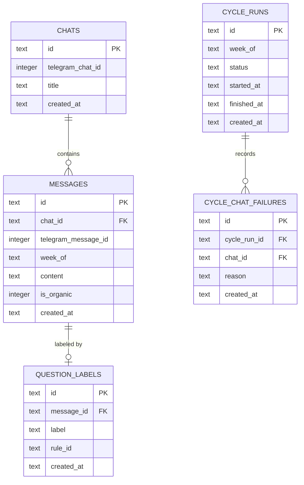

# Data model — tg-assistant (прогін через `migrations-forge`)

<!-- ПОРІВНЯЛЬНИЙ артефакт, не заміна docs/features/tg-assistant/data-model.md.
Той самий вхід (PRD.md §4/§5, sad.md §6 потік 1) і той самий набір сутностей —
але прогнаний через власний скіл migrations-forge (SQLite-дефолти) замість
курсового generate-data-model (Postgres-дефолти). Різниці позначені inline
коментарем «Δ migrations-forge:». -->

## ER diagram

<!-- Δ migrations-forge: типи атрибутів — SQLite type affinity (text/integer),
не Postgres (uuid/bigint/varchar/text/boolean/timestamptz) як в оригіналі.
Структура сутностей і зв'язків — ІДЕНТИЧНА оригіналу (той самий PRD/§6 вхід). -->

## Entities

### `chats`

| Column | Type | Constraints | Notes |
|---|---|---|---|
| `id` | TEXT | PK, генерується в коді (UUID v7 як рядок) | Δ: `UUID`→`TEXT` |
| `telegram_chat_id` | INTEGER | NOT NULL, UNIQUE | Δ: `BIGINT`→`INTEGER` (SQLite INTEGER — 8 байт, вміщає Telegram ID без проблем) |
| `title` | TEXT | NOT NULL | Δ: `VARCHAR(255)`→`TEXT` (SQLite ігнорує N) |
| `created_at` | TEXT | NOT NULL DEFAULT (strftime('%Y-%m-%dT%H:%M:%fZ','now')) | Δ: `TIMESTAMPTZ`+`now()`→`TEXT`+`strftime` |

**Aggregate root:** root.
**Access patterns:** та сама, що оригінал — повний скан, індекс не виправданий.
**Constraints:** UNIQUE на `telegram_chat_id` — та сама.

### `messages`

| Column | Type | Constraints | Notes |
|---|---|---|---|
| `id` | TEXT | PK, генерується в коді (UUID v7) | |
| `chat_id` | TEXT | NOT NULL, FK → `chats(id)` | |
| `telegram_message_id` | INTEGER | NOT NULL | |
| `week_of` | TEXT | NOT NULL | той самий формат (`2026-W32`), тип не змінився (уже був рядком) |
| `content` | TEXT | NOT NULL | той самий тип, що оригінал (уже TEXT там) |
| `is_organic` | INTEGER | NOT NULL | Δ: `BOOLEAN`→`INTEGER` (0/1) |
| `created_at` | TEXT | NOT NULL DEFAULT (strftime('%Y-%m-%dT%H:%M:%fZ','now')) | |

**Aggregate root:** `chats`.
**Access patterns:** та сама — «вже зібрано цим тижнем для цього чату» → `idx_messages_chat_week`.
**Constraints:** UNIQUE на (`chat_id`, `telegram_message_id`); FK → `chats(id)`.

### `question_labels`

| Column | Type | Constraints | Notes |
|---|---|---|---|
| `id` | TEXT | PK | |
| `message_id` | TEXT | NOT NULL, UNIQUE, FK → `messages(id)` | |
| `label` | TEXT | NOT NULL | Δ: `VARCHAR(32)`→`TEXT`; той самий принцип — enum-in-app |
| `rule_id` | TEXT | NULL | Δ: `VARCHAR(64)`→`TEXT` |
| `created_at` | TEXT | NOT NULL DEFAULT (strftime('%Y-%m-%dT%H:%M:%fZ','now')) | без `updated_at` — та сама причина (AC-06 immutable-first) |

**Aggregate root:** `messages`.
**Constraints:** UNIQUE на `message_id` — той самий btree-еквівалент закриває FK self-check, без окремого `CREATE INDEX`.

### `cycle_runs`

| Column | Type | Constraints | Notes |
|---|---|---|---|
| `id` | TEXT | PK | |
| `week_of` | TEXT | NOT NULL, UNIQUE | |
| `status` | TEXT | NOT NULL | Δ: `VARCHAR(32)`→`TEXT` |
| `started_at` | TEXT | NOT NULL | Δ: `TIMESTAMPTZ`→`TEXT` |
| `finished_at` | TEXT | NULL | |
| `created_at` | TEXT | NOT NULL DEFAULT (strftime('%Y-%m-%dT%H:%M:%fZ','now')) | |

**Aggregate root:** root.
**Constraints:** UNIQUE на `week_of`.

### `cycle_chat_failures`

| Column | Type | Constraints | Notes |
|---|---|---|---|
| `id` | TEXT | PK | |
| `cycle_run_id` | TEXT | NOT NULL, FK → `cycle_runs(id)` | |
| `chat_id` | TEXT | NOT NULL, FK → `chats(id)` | |
| `reason` | TEXT | NOT NULL | Δ: `VARCHAR(255)`→`TEXT` |
| `created_at` | TEXT | NOT NULL DEFAULT (strftime('%Y-%m-%dT%H:%M:%fZ','now')) | |

**Aggregate root:** `cycle_runs`.
**Constraints:** FK → `cycle_runs(id)`, FK → `chats(id)`.

## Indexes

| Index | Columns | Query it serves | Δ від оригіналу |
|---|---|---|---|
| `idx_messages_chat_week` | `messages(chat_id, week_of)` | дедуп-крок (AC-09); провідна колонка закриває FK-індекс `chat_id` | немає — та сама логіка |
| `idx_cycle_chat_failures_cycle_run_id` | `cycle_chat_failures(cycle_run_id)` | звіт недоступних чатів циклу (AC-08) | немає — та сама логіка |
| `idx_cycle_chat_failures_chat_id` | `cycle_chat_failures(chat_id)` | обов'язковий FK-індекс | немає — та сама логіка |

`question_labels.message_id` — без окремого індексу (той самий аргумент, що
оригінал: `UNIQUE` уже створює btree). Індексна стратегія тут **не
розійшлась** з курсовим прогоном — це очікувано: обидва скіли виводять
індекси з тих самих persist-нотаток §6, різниця лише в типах колонок, не в
тому, ЩО індексувати.

## Test fixtures

Ті самі 4 фабрики, що оригінал (`newChat`, `newMessage`, `newQuestionLabel`,
`newCycleRun`) — фабрики не залежать від СУБД.

## Self-check (4/4)

1. **Naming** — OK, ідентично оригіналу.
2. **down/up symmetry** — OK.
3. **FK indexes** — OK.
4. **Forbidden features** — OK, плюс перевірка на `CONCURRENTLY`/`ALTER COLUMN`/`VARCHAR`/`TIMESTAMPTZ`/`UUID`/`BOOLEAN` (SQLite-профіль) — 0 збігів (перевірено grep, staged-файли нижче).

Немає breaking change для цієї фічі (greenfield, той самий стан, що
оригінал) — тож найважливіша різниця цього скіла (table-rebuild замість
`ALTER COLUMN`) тут не проявляється; вона проявилась на `rules-change-monitor`
(курсовий прогін, roundtrip-тест 2026-08-07).
