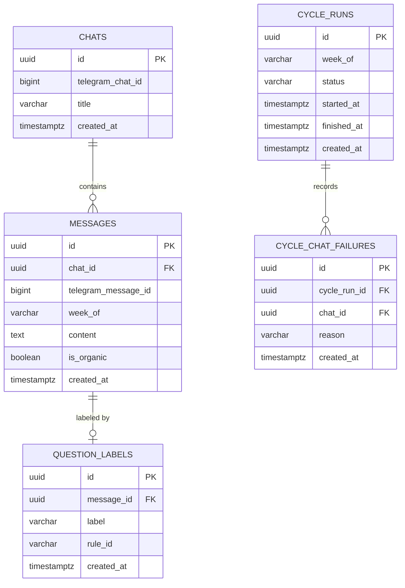

# Data model — tg-assistant

<!-- Generated per generate-data-model protocol (skill run manually — SKILL.md, unvendored).
Migrations are STAGED under docs/features/tg-assistant/migrations/ (NOT a live migrations/
tree — this repo has none, docs/architecture-map.md §Сховища даних: «БД — Немає»).
Ця модель — навчальний прогін пайплайна уроку 6.5, не заміна ADR-0003 (state.json). -->

## ER diagram

## Entities

### `chats`

| Column | Type | Constraints | Notes |
|---|---|---|---|
| `id` | UUID | PK, app-generated (UUID v7) | |
| `telegram_chat_id` | BIGINT | NOT NULL, UNIQUE | зовнішній ідентифікатор Telegram, не PK (курсовий дефолт — UUID app-side) |
| `title` | VARCHAR(255) | NOT NULL | назва чату на момент приєднання |
| `created_at` | TIMESTAMPTZ | NOT NULL DEFAULT now() | момент, коли дослідник приєднався (AC-10 відлічує вікно N тижнів від цього) |

**Aggregate root:** root (власна агрегація, `messages` — дочірня).
**Access patterns:** «список чатів, де дослідник учасник» (потік 1, крок 1) → повний скан, N мале, індекс не виправданий.
**Constraints:** UNIQUE на `telegram_chat_id` — не той самий чат двічі (AC-02: чужий чат ніколи не потрапляє в цю таблицю взагалі, гейт спрацьовує до запису).

### `messages`

| Column | Type | Constraints | Notes |
|---|---|---|---|
| `id` | UUID | PK, app-generated (UUID v7) | |
| `chat_id` | UUID | NOT NULL, FK → `chats(id)` | індексовано нижче |
| `telegram_message_id` | BIGINT | NOT NULL | |
| `week_of` | VARCHAR(10) | NOT NULL | ISO-тиждень циклу (`2026-W32`) — ключ ідемпотентності дедупу (AC-09) |
| `content` | TEXT | NOT NULL | повний текст питання; без обмеження довжини (Telegram-повідомлення) |
| `is_organic` | BOOLEAN | NOT NULL | результат фільтра US-02; `TRUE` — пройшло в розмітку |
| `created_at` | TIMESTAMPTZ | NOT NULL DEFAULT now() | |

**Aggregate root:** `chats` (FK `chat_id`).
**Access patterns:** «чи це повідомлення вже зібране цього тижня для цього чату» (потік 1, ідемпотентний крок AC-09) → індекс `idx_messages_chat_week`.
**Constraints:** UNIQUE на (`chat_id`, `telegram_message_id`) — та сама подія Telegram не запишеться двічі навіть при повторному прогоні циклу; FK → `chats(id)`.

<!-- Why: AC-04 (одне повідомлення — кілька тем — рахується один раз) закривається на рівні
рядка "одне повідомлення = один рядок messages"; розкладка на теми — не окрема таблиця,
бо PRD не вимагає зберігати теми окремо від мітки. -->

### `question_labels`

| Column | Type | Constraints | Notes |
|---|---|---|---|
| `id` | UUID | PK, app-generated (UUID v7) | |
| `message_id` | UUID | NOT NULL, UNIQUE, FK → `messages(id)` | одна мітка на повідомлення (1:1) |
| `label` | VARCHAR(32) | NOT NULL | `covered` \| `white_spot` — enum-in-app, не CHECK |
| `rule_id` | VARCHAR(64) | NULL | заповнено лише при `label = covered`; той самий `rule_id`, що в `rules.2026.json` |
| `created_at` | TIMESTAMPTZ | NOT NULL DEFAULT now() | момент розмітки — навмисно без `updated_at` |

**Aggregate root:** `messages` (FK `message_id`).
**Access patterns:** «звіт тижня: мітка + rule_id для кожного питання» (AC-07) → читається разом із `messages` по `message_id`.
**Constraints:** UNIQUE на `message_id` (1:1) — цей самий UNIQUE-індекс закриває й обов'язковий FK-індекс (self-check), окремий `CREATE INDEX` на ту саму колонку був би дублем; FK → `messages(id)`.

<!-- Why: AC-06 (мітки минулих звітів не переписуються заднім числом при оновленні матриці)
закривається САМЕ відсутністю updated_at — рядок immutable від моменту створення, повторний
цикл для того самого message_id неможливий (message вже дедуплікований на рівні messages).
Це не окреме рішення, а прямий наслідок курсового дефолту "created_at-only". -->

### `cycle_runs`

| Column | Type | Constraints | Notes |
|---|---|---|---|
| `id` | UUID | PK, app-generated (UUID v7) | |
| `week_of` | VARCHAR(10) | NOT NULL, UNIQUE | ключ ідемпотентності самого циклу (потік 1, крок 2) |
| `status` | VARCHAR(32) | NOT NULL | `completed` \| `partial` — enum-in-app |
| `started_at` | TIMESTAMPTZ | NOT NULL | |
| `finished_at` | TIMESTAMPTZ | NULL | NULL, доки цикл не завершено |
| `created_at` | TIMESTAMPTZ | NOT NULL DEFAULT now() | |

**Aggregate root:** root (`cycle_chat_failures` — дочірня).
**Access patterns:** «чи цей тиждень уже оброблено» (ідемпотентний гейт) → UNIQUE на `week_of` вже є btree-індексом, окремий не потрібен.
**Constraints:** UNIQUE на `week_of`.

### `cycle_chat_failures`

| Column | Type | Constraints | Notes |
|---|---|---|---|
| `id` | UUID | PK, app-generated (UUID v7) | |
| `cycle_run_id` | UUID | NOT NULL, FK → `cycle_runs(id)` | індексовано нижче |
| `chat_id` | UUID | NOT NULL, FK → `chats(id)` | індексовано нижче |
| `reason` | VARCHAR(255) | NOT NULL | текст причини недоступності (timeout / виключено / видалено) |
| `created_at` | TIMESTAMPTZ | NOT NULL DEFAULT now() | |

**Aggregate root:** `cycle_runs` (FK `cycle_run_id`).
**Access patterns:** «явно назвати всі недоступні чати цього тижня» (AC-08, dead-letter гілка потоку 1) → індекс `idx_cycle_chat_failures_cycle_run_id`.
**Constraints:** FK → `cycle_runs(id)`, FK → `chats(id)`.

## Indexes

| Index | Columns | Query it serves |
|---|---|---|
| `idx_messages_chat_week` | `messages(chat_id, week_of)` | ідемпотентний дедуп-крок потоку 1: «вже зібрано цим тижнем для цього чату» (AC-09); `chat_id` — провідна колонка, тож той самий індекс закриває й обов'язковий FK-індекс на `chat_id` (self-check) — окремого `idx_messages_chat_id` не потрібно |
| `idx_cycle_chat_failures_cycle_run_id` | `cycle_chat_failures(cycle_run_id)` | звіт: усі недоступні чати конкретного циклу (AC-08) |
| `idx_cycle_chat_failures_chat_id` | `cycle_chat_failures(chat_id)` | обов'язковий FK-індекс (self-check) |

`question_labels.message_id` — FK-індекс не додається окремо: `UNIQUE(message_id)` уже
створює btree-індекс, який self-check зараховує як FK-індекс (перевірено на кроці
«self-check» нижче). Індексів «про всяк випадок» немає — кожен або обов'язковий self-check
FK-індекс, або має конкретний запит із потоку 1 / AC.

## Test fixtures

<!-- Проєкт не має ORM/тестового DB-шару (client-only, vitest) — фабрики описані як план,
не як згенеровані файли; реальний файл з'явиться, коли фіча дійде до implement-tasks. -->

- `newChat(overrides?)` — чат з дефолтним `telegram_chat_id`, унікальним на кожен виклик.
- `newMessage(chatId, overrides?)` — повідомлення з `is_organic: true` за замовчуванням.
- `newQuestionLabel(messageId, overrides?)` — мітка `covered` з фейковим `rule_id`.
- `newCycleRun(overrides?)` — цикл зі `status: 'completed'`.

PII guard: жодних фікстур із реальними email/іменами не передбачено — глосарій-приклади
використовують `Test User`, `user-<uuid>@example.test`, якщо колись знадобляться дані
дослідника в самих фікстурах (наразі не потрібні — `chats`/`messages` не містять PII
дослідника, лише чужий текст повідомлень із публічних чатів).
