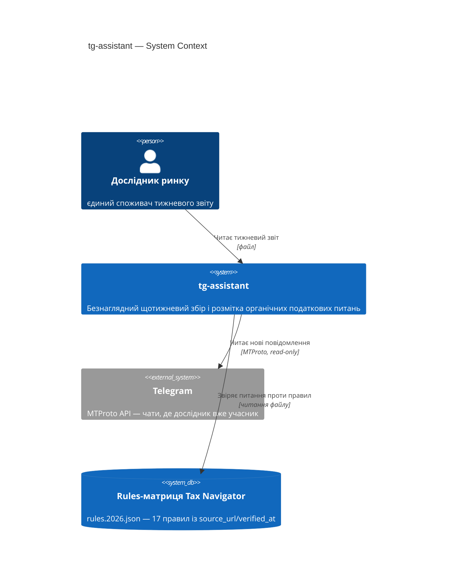

# Software Architecture Document — tg-assistant (прогін через `sad-forge`)

<!-- ПОРІВНЯЛЬНИЙ артефакт, не заміна docs/features/tg-assistant/sad.md.
Той самий вхід (PRD.md, CONTEXT.md, той самий reference-модуль), той самий
обсяг (§1-§5, як простий рівень 6.4) — але прогнаний через власний скіл
sad-forge замість вендорованого architecture-design. Мета — порівняти вихід,
не продублювати роботу. Різниці від оригіналу sad.md позначені inline
коментарем «Δ sad-forge:». -->

## 1. Вступ і цілі

**Намір.** Безнаглядний щотижневий помічник, що збирає органічні податкові
питання з чатів, де Дослідник ринку вже учасник, розмічає кожне як
«покрито»/«біла пляма» проти rules-матриці й готує тижневий звіт — для
самого Дослідника ринку як єдиного споживача.

**Топ-3 якості (одним рядком; повні сценарії в §10):**

1. **Доступність** — цикл переживає пропущений тиждень і частковий збій без хибного нуля (≥90% на ковзному 12-тижневому вікні, AC-08/09).
2. **Точність** — кожна мітка «покрито» цитує дійсний `rule_id` (100%, AC-05/06).
3. **Обмежена тривалість** — цикл ≤30хв без backfill / ≤2год із backfill (AC-10), ≥10 чатів без переривання rate limit.

**Stakeholders.**

<!-- Δ sad-forge: в оригінальному sad.md тут два рядки — «Дослідник ринку (Ні)»
+ «Tech Lead (Так)». Роль «Tech Lead» не існує в CONTEXT.md tg-assistant
(єдина роль — «Дослідник ринку»), і саме цю помилку критик зловив пізніше
на rules-change-monitor (F6). Шаблон sad-forge явно застерігає проти
вигаданих sign-off-ролей (SKILL.md §Відмінність 1, templates/sad-template.md
§1 коментар) — тож тут sign-off одразу на реальній ролі, без проміжного
помилкового кроку. -->

| Роль | Інтерес | Sign-off? |
|---|---|---|
| Дослідник ринку | Єдиний споживач тижневого звіту + затверджує SAD | Так |

## 2. Обмеження

**Технічні.**
- Node.js ≥18 — вже вимога для MTProto-клієнта (`research/tg-mining/01-SETUP.md:7`)
- Читає `app/lib/rules/types.ts` напряму як чисту TS-бібліотеку — шар `rules/` не має npm-залежностей (`CLAUDE.md`, правило залежностей)
- **Telegram MTProto віддає `FLOOD_WAIT_X` при частих запитах** (`research/tg-mining/01-SETUP.md:35`) — конкретний технічний обмежувач із ручних раундів збору

**Організаційні.**
- Соло-команда (Mike, у ролі Дослідника ринку)
- М'який дедлайн — курс завершується 09.2026 (PRD §1)
- Бюджет часу не названий у PRD → `<TBD by PM>`, рядок у §11

**Конвенції.**
- Read-only місія до Telegram (`CLAUDE.md`, `research/tg-mining/README.md`)
- Формат даних-правил: `rule_id` + `params` + `source_url` + `verified_at`

**Регуляторні / зовнішні.**
- PRD §6.1: Confidential у памʼяті / Internal похідні на диску, TTL 90 днів
- Немає нової авторизаційної межі — лише членство в чаті (AC-02)

## 3. Контекст і межі

tg-assistant — окремий read-only інструмент поза шаром
presentation→adapters→calc→rules основного застосунку — окремий процес, не
інтеграція у Next.js-продукт.

**Зовнішні системи (in/out):**

| Актор або система | Тип | Взаємодія |
|---|---|---|
| Дослідник ринку | Person | Читає тижневий звіт |
| Telegram | System (external) | MTProto, read-only читання повідомлень |
| Rules-матриця Tax Navigator | System (external) | Читання для розмітки; життєвий цикл веде rules-change-monitor |

**C4 Context (L1):**

*(Без Δ — той самий C4Context, що в оригіналі: reference-модуль і мапа однозначно вказують на ту саму розкладку незалежно від скіла.)*

## 4. Стратегія рішення

**Target surface(s):** `[worker]`

<!-- Δ sad-forge: обрано через таблицю «Рекомендовані контейнери» (SKILL.md
§Відмінність 2) — «tooling-скрипт поза app/lib» + слово «безнаглядно» в US-01
→ прямий lookup у worker, без окремого AskUserQuestion. Той самий висновок,
що в оригіналі, іншим шляхом (таблиця, не вільне міркування). -->

**Стратегічні вибори (насіння для ADR), радіус удару — 4 критерії:**

1. **Пряма MTProto-бібліотека замість інтерактивної Claude+MCP сесії** — незворотнє (так) + мультимодульно (так) + чесна альтернатива (так) + зачіпає сховище (ні — про клієнт, не про дані) = **3/4 → ADR**. Той самий висновок, що оригінал (там було 3/3).
2. **Черга з експоненційним відступом при `FLOOD_WAIT_X`** (конкретне посилання на §2-інцидент, як в оригіналі) — мультимодульно (так) + чесна альтернатива (так) + зачіпає сховище (ні) = **2/4 → ADR**. Той самий висновок.
3. **Локальний JSON-файл стану циклу** — мультимодульно (так, дедуп+catch-up+report) + **зачіпає сховище (так — прямий, не розтягнутий критерій)** = **2/4 мінімум → ADR**, без потреби розтягувати «незворотнє» для виправдання (в оригіналі це рішення вийшло 3/3 саме розтягуванням критерію 1). Той самий висновок, чистіше обґрунтування.

<!-- Δ sad-forge підсумок §4: усі три висновки (ADR/ADR/ADR) ідентичні оригіналу.
Різниця — не у ВИСНОВКАХ, а в тому, ЯК їх обґрунтовано: стовп 3 більше не
спирається на розтягнуте «незворотнє», а на прямий 4-й критерій. -->

## 5. Будівельні блоки

Простий pipeline, `research/tg-assistant/` (той самий прецедент
`research/tg-mining/`, обраний через явну підказку sad-forge templates
«цитуй конкретний прецедент з architecture-map.md, не вигадуй новий патерн»).

**Внутрішня декомпозиція:** *(ідентична оригіналу — collector/filter/labeler/reporter/state/cycle)*

**C4 Container (L2):** *(ідентичний оригіналу — один worker-контейнер, ContainerDb для стану)*

*(Без Δ у контенті §5 — обидва скіли дійшли до того самого дерева каталогів і тієї самої C4Container-діаграми; sad-forge лише підтвердив вибір через свою таблицю рекомендованих контейнерів замість вільного AskUserQuestion.)*
