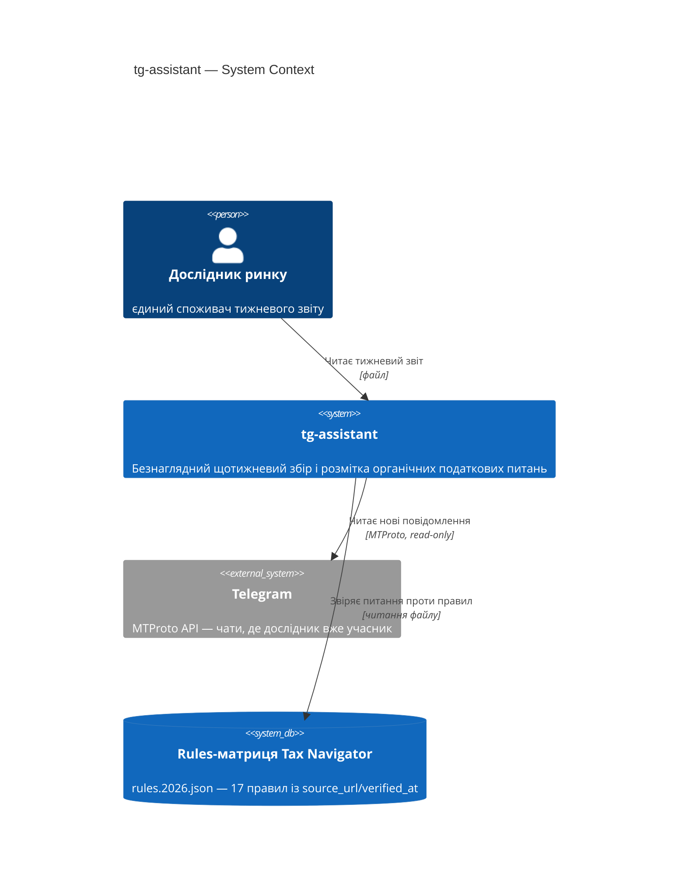
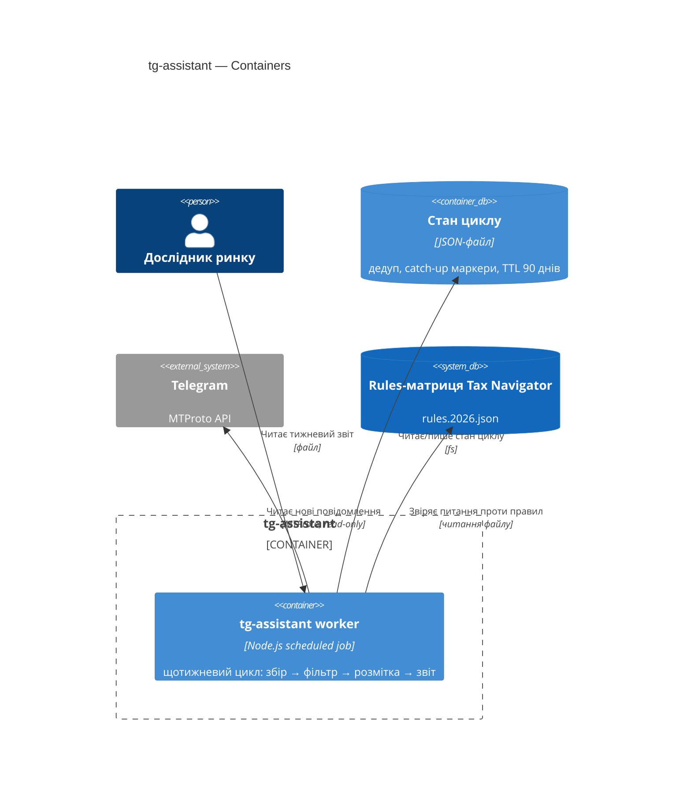
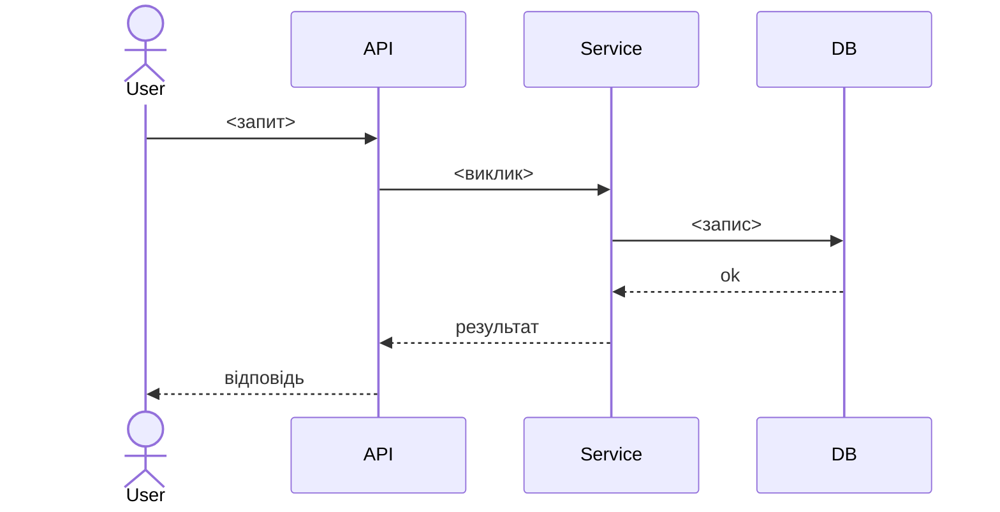

# Software Architecture Document — tg-assistant

<!-- 12 секцій arc42. Порожня секція — лише <!-- N/A: причина одним реченням -->.
C4 Context (L1) inline у §3. C4 Container (L2) inline у §5.
§6 сіє лише головний потік — решту AC покриє майбутня стадія complete-sequence-diagrams.
Числа в §10 — ДОСЛІВНО з PRD §6 NFR, без округлень і вигадок. -->

## 1. Вступ і цілі

<!-- 1 абзац наміру з PRD §2 Цілі + топ-3 якості (повні сценарії — у §10) + таблиця stakeholders. -->

**Намір.** Безнаглядний щотижневий помічник, що збирає органічні податкові
питання з чатів, де Дослідник ринку вже учасник, розмічає кожне як
«покрито»/«біла пляма» проти rules-матриці й готує тижневий звіт — для
самого Дослідника ринку як єдиного споживача.

**Топ-3 якості (одним рядком; повні сценарії в §10):**

1. **Доступність** — цикл переживає пропущений тиждень і частковий збій без хибного нуля (≥90% на ковзному 12-тижневому вікні, AC-08/09).
2. **Точність** — кожна мітка «покрито» цитує дійсний `rule_id` (100%, AC-05/06).
3. **Обмежена тривалість** — цикл ≤30хв без backfill / ≤2год із backfill (AC-10), ≥10 чатів без переривання rate limit.

**Stakeholders.**

| Роль | Інтерес | Sign-off? |
|---|---|---|
| Дослідник ринку | Єдиний споживач тижневого звіту | Ні |
| Tech Lead | Затвердження SAD | Так |

<!-- Decision overrides (¶4) — заповнює резолюція критика на кроці 7, інакше порожньо. -->
<!-- Формат рядка: «Decision override: <заголовок> — rationale: <причина>» -->

## 2. Обмеження

<!-- §4 (стратегія) працює лише коли §2 зафіксувала, ЩО ВЖЕ ЗАФІКСОВАНО — це вхід, не вихід. Ніколи N/A. -->

**Технічні.**
- Node.js ≥18 — вже вимога для MTProto-клієнта (`research/tg-mining/01-SETUP.md:7`)
- Читає `app/lib/rules/types.ts` (`getRule`/`getParams`/`sourcesOf`) напряму як чисту TS-бібліотеку — шар `rules/` не має npm-залежностей і нічого, крім себе, не імпортує (`CLAUDE.md`, правило залежностей)
- **Telegram MTProto віддає `FLOOD_WAIT_X` при частих запитах** (`research/tg-mining/01-SETUP.md:35`) — конкретний технічний обмежувач із ручних раундів збору, не гіпотетичний

**Організаційні.**
- Соло-команда (Mike)
- М'який дедлайн — курс завершується 09.2026 (PRD §1), після чого фокус зміщується на сезон PIT 2027
- Бюджет часу не названий у PRD → `<TBD by PM>`, рядок у §11

**Конвенції.**
- Read-only місія до Telegram (`CLAUDE.md`, `research/tg-mining/README.md`) — автовідправка ботом окреме рішення на кожен канал, не наслідок цього правила
- Формат даних-правил: `rule_id` + `params` + `source_url` + `verified_at` (reference-модуль з PRD, `app/lib/rules/types.ts`)

**Регуляторні / зовнішні.**
- PRD §6.1: Confidential під час обробки (сирий текст у памʼяті процесу), Internal для похідних даних на диску, TTL похідних 90 днів, сирий текст на диск не пишеться
- Немає нової авторизаційної межі — єдина межа доступу: членство в чаті (AC-02)

## 3. Контекст і межі

<!-- Малює МЕЖУ СИСТЕМИ — хто говорить з нею ззовні, де закінчується зона довіри. Ніколи N/A. -->

tg-assistant — окремий read-only інструмент поза шаром
presentation→adapters→calc→rules основного застосунку
(`docs/architecture-map.md`) — окремий процес, не інтеграція у Next.js-продукт.
Межа довіри: інструмент лише читає Telegram і `rules.2026.json`, ніколи не
пише в жоден з них; авторизації немає — єдиний користувач один.

**Зовнішні системи (in/out):**

| Актор або система | Тип | Взаємодія |
|---|---|---|
| Дослідник ринку | Person | Читає тижневий звіт |
| Telegram | System (external) | MTProto, read-only читання повідомлень з чатів-учасника |
| Rules-матриця Tax Navigator | System (external) | Читання для розмітки «покрито»/«біла пляма»; життєвий цикл веде rules-change-monitor, не tg-assistant |

**C4 Context (L1):**



## 4. Стратегія рішення

<!-- 3-4 СТРАТЕГІЧНІ СТОВПИ, з яких ростуть ADR. Найгустіша секція — gate спрацьовує майже завжди. -->

**Target surface(s) (перше рішення — що саме будуємо):** `[worker]`
<!-- Scheduled job без request/response-поверхні й без UI — точно матчить "безнаглядно
обходить чати раз на тиждень" з US-01. Один surface, gate не спрацьовує (немає
мультиповерхневості), рішення лишається inline. -->

**Стратегічні вибори (насіння для ADR):**

1. **Пряма MTProto-бібліотека замість інтерактивної Claude+MCP сесії** — цикл мусить бути безнаглядним (US-01, Топ-3 якість «Обмежена тривалість»); жива сесія з MCP-сервером (`research/tg-mining/01-SETUP.md`) не автоматизується без людини за клавіатурою, а вкладений `claude -p` за розкладом задокументовано ненадійний (`environment-limits.md`). → [ADR-0001](adr/0001-direct-mtproto-library-over-interactive-mcp.md).
2. **Черга запитів по чатах з експоненційним відступом, що читає конкретне значення X із самої помилки `FLOOD_WAIT_X` Telegram** (§2 Обмеження, `research/tg-mining/01-SETUP.md:35` — той самий обмежувач, що вже зупиняв ручні раунди збору) і призупиняє лише той чат, що впав у ліміт, а не весь прогін. Забезпечує NFR ≥10 чатів за прогін (Топ-3 якість «Обмежена тривалість») і AC-08 (явна причина збою на чат). → [ADR-0002](adr/0002-per-chat-backoff-queue-for-flood-wait.md).
3. **Локальний JSON-файл стану циклу** — дедуп для catch-up (AC-09), маркери вікна backfill (AC-10), TTL 90 днів для похідних даних (§6.1), без сирого тексту на диску. Не SQLite/Postgres — соло-інструмент, один читач/один писар, узгоджено з тим, що основний продукт теж без БД (`architecture-map.md`). → [ADR-0003](adr/0003-json-file-for-cycle-state.md).

Кожне тактичне рішення в наступних секціях має простежуватись до одного з цих
стовпів. Тактичне рішення, що суперечить стовпу, — червоний прапорець, виносити
в §11.

## 5. Будівельні блоки

<!-- ВНУТРІШНЯ ДЕКОМПОЗИЦІЯ — модулі, контейнери, БД. Хто з ким може говорити. -->

Простий pipeline, не гексагональна розкладка — одна поверхня (`worker`),
одна команда запуску за розкладом, немає причини платити за шари
domain/app/infra/ports заради одного cron-скрипта. Чотири модулі виконуються
послідовно (collector → filter → labeler → reporter), спільний стан читає й
пише кожен з них через єдиний `state.json` (ADR-0003).

**Внутрішня декомпозиція:**

```
research/tg-assistant/
├── collector.ts   <MTProto-клієнт (ADR-0001), backoff-черга по чатах (ADR-0002)>
├── filter.ts       <відсіює органічне питання (US-02) від шуму>
├── labeler.ts       <звіряє з rules.2026.json через app/lib/rules/types.ts (US-03)>
├── reporter.ts       <збирає тижневий звіт (US-04)>
├── state.ts           <читає/пише state.json — дедуп, catch-up, TTL (ADR-0003)>
└── cycle.ts             <self-wiring — точка входу для cron>
```

**C4 Container (L2):** одна оголошена `target_surface` → один `Container`.



## 6. Виконання (runtime)

<!-- ПОТІК RUNTIME для 1-2 критичних сценаріїв. Учасники — імена з §5, нових не вигадувати.
Повідомлення семантичні, БЕЗ HTTP-методів/шляхів — це територія майбутнього api-forge.
Цей скіл сіє лише головний потік; повне покриття кожного AC — окрема майбутня стадія. -->

**Критичний потік 1: <назва>**



<!-- Для XS/S — 1 потік достатньо. Для M+ — додати 2-4 (failure-mode, async). -->

**Критичний потік 2: <напр. поширення події>** — <якщо застосовно, інакше N/A>.

## 7. Розгортання

<!-- ТОПОЛОГІЯ — скільки реплік, де живе фоновий обробник, при яких числах масштабуємось.
N/A допустимо для XS/S, що переюзає наявне розгортання без змін. -->

<Топологія у 2-3 реченнях: де живе, репліки, пороги масштабування.>

**Моніторинг:**
- <метрики>
- <алерти>
- <трасування>

**Пороги масштабування:**
- <конкретне число, не «при зростанні подумаємо»>

<!-- Для XS/S без змін розгортання: <!-- N/A: фіча переюзає наявний деплой-юніт --> -->

## 8. Наскрізні концепції

<!-- НАСКРІЗНІ ПАТЕРНИ через кілька модулів: логування, помилки, авторизація, ID-стратегія, кеш.
Патерн всередині одного модуля — не сюди. Конвенція проєкту в цілому — у CLAUDE.md, не тут. -->

| Концепція | Конвенція | Де визначено |
|---|---|---|
| Логування | <напр. структуроване, поля `module=<name>`> | <CLAUDE.md §X або тут> |
| Автентифікація | <напр. сесія / JWT> | <CLAUDE.md §X> |
| Обробка помилок | <sentinel → ports → JSON-мапінг> | <CLAUDE.md §X> |
| ID-стратегія | <UUID v7 / auto-increment> | <CLAUDE.md §X> |
| Інтернаціоналізація | <напр. N/A, лише UA> | — |
| Спостережність | <метрики/трасування, якщо є> | — |

## 9. Архітектурні рішення

<!-- ЗВОРОТНИЙ ІНДЕКС на adr/. Один рядок на ADR. Заповнюється по ходу кроку 6 gate, не тут заздалегідь. -->

| # | Назва | Статус | Секція |
|---|---|---|---|
| 0001 | Use a direct MTProto library instead of an interactive Claude+MCP session | Accepted | §4 |
| 0002 | Per-chat exponential-backoff queue keyed on Telegram's FLOOD_WAIT_X | Accepted | §4 |
| 0003 | Local JSON file for weekly-cycle state instead of a database | Accepted | §4 |

ADR-файли — `docs/features/tg-assistant/adr/NNNN-<title>.md`.

<!-- N/A допустимо лише якщо жодне рішення не спрацювало на gate (типово для XS): <!-- N/A: no decisions crossed blast-radius threshold --> -->

## 10. Вимоги якості

<!-- ДЕРЕВО ЯКОСТЕЙ — кожна ціль з §1 розкладена на When/Then/How-verify. Числа ДОСЛІВНО з PRD §6 NFR. -->

**QG-1. <якість>**
- **When:** <умова тригера>
- **Then:** <очікувана поведінка з числом з PRD NFR>
- **How verify:** <тест / навантажувальний прогін / метрика — не «інтеграційний тест»>

**QG-2. <якість>**
- **When:** <умова>
- **Then:** <очікувано>
- **How verify:** <як>

**QG-3. <якість>**
- **When:** <умова>
- **Then:** <очікувано>
- **How verify:** <як>

## 11. Ризики та технічний борг

<!-- Збирає ВСЕ, що може зламатись — не лише технічне. Ніколи N/A. -->
<!-- Severity: Low/Medium/High для звичайних ризиків; літерально "Open question" для рядків
     з дії «Винести у відкрите питання» на кроці 6. -->

| Ризик / борг | Серйозність | Мітигація | Власник |
|---|---|---|---|
| <напр. затримка outbox під час збою даунстріму> | Medium | <алерт, план дій, retry> | <роль> |
| Open architectural decision: <заголовок> | Open question | Resolve before <дата/стадія>; <причина> | <власник> |

**Прийнятий борг (ок для v1, план на потім):**
- <напр. сутність без версіонування — ок для v1>

## 12. Глосарій

<!-- СЛОВНИК ДОМЕНУ. Джерело — CONTEXT.md + терміни, що зʼявились під час Socratic walk. Ніколи N/A. -->

| Термін | Значення |
|---|---|
| <термін з CONTEXT.md> | <значення> |
